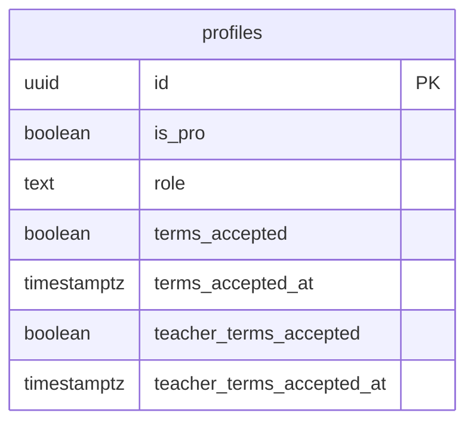
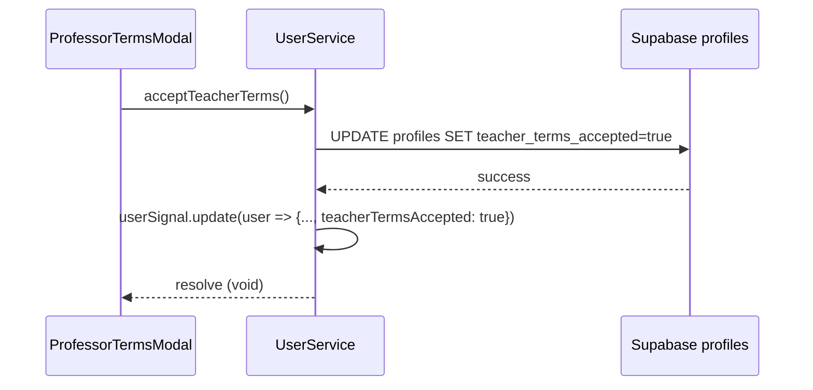
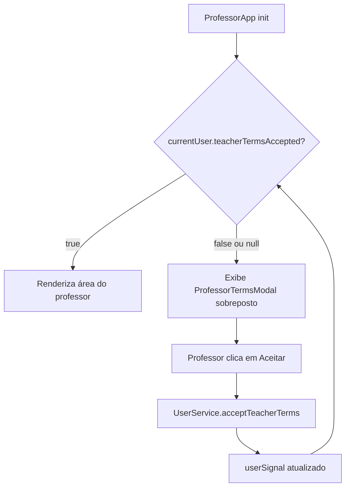
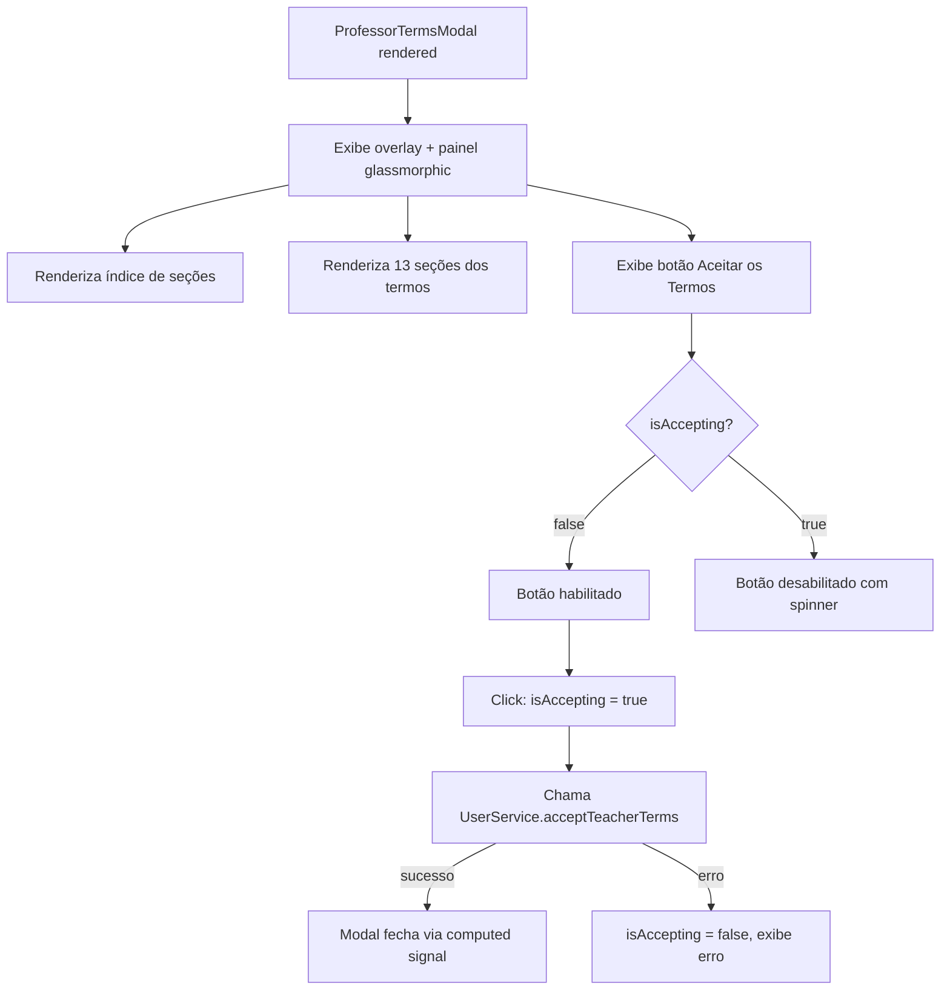
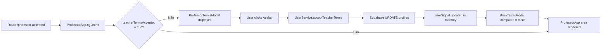
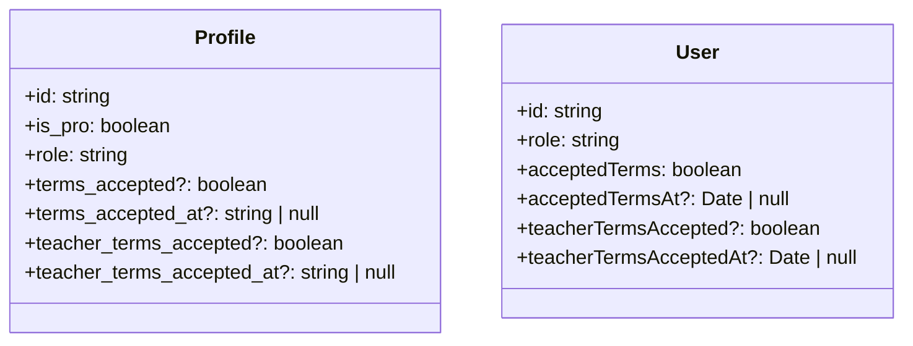

# Design Document

## Overview

Esta feature adiciona suporte aos Termos de Uso do Professor na plataforma Semeando Devs. A mudança é composta por três camadas independentes: (1) persistência — dois novos campos na tabela `profiles` do Supabase e atualização do modelo TypeScript; (2) serviço — um novo método em `UserService` responsável por persistir e sincronizar o aceite; e (3) apresentação — um componente Angular de modal exibido dentro do shell `ProfessorApp`, que lê o estado de aceite do `userSignal` e bloqueia a interação com a área do professor enquanto o aceite não for confirmado.

A verificação acontece no ciclo de inicialização do componente `ProfessorApp` (já existente), sem introduzir novos guards ou rotas. O modal é renderizado condicionalmente com `@if` diretamente no template do shell, seguindo os padrões de controle de fluxo já adotados no projeto. O conteúdo dos termos é estático e embutido no template do componente, sem dependência de API externa.

A camada visual segue fielmente o design system já estabelecido em `TermsOfUse` (termos do usuário): glassmorphism, palete neon, tipografia Plus Jakarta Sans/Inter/Space Grotesk, índice de navegação rápida com scroll suave, e ausência de bordas 1px. O componente é criado em `src/app/pages/professor/components/professor-terms/` seguindo a estrutura de componentes de suporte já existente (`header-professor`, `aside-professor`).

### Change Type

`new-feature`

### Design Goals

1. Bloquear o uso da área do professor até o aceite explícito dos termos, sem redirecionar para outra rota.
2. Persistir o aceite de forma confiável no Supabase e refletir imediatamente no `userSignal` para evitar re-exibição na sessão.
3. Manter total consistência visual com os termos de usuário existentes (`TermsOfUse`).
4. Centralizar toda lógica de persistência no `UserService`, mantendo o componente focado apenas na apresentação.

### References

- **REQ-1**: Campos de Aceite dos Termos do Professor no Banco de Dados
- **REQ-2**: Verificação de Aceite ao Acessar a Área do Professor
- **REQ-3**: Conteúdo e Estrutura dos Termos do Professor
- **REQ-4**: Ação de Aceite dos Termos do Professor
- **REQ-5**: Sincronização do Estado do Usuário após Aceite

---

## System Architecture

### DES-1: Extensão do Esquema de Banco de Dados e Modelo TypeScript

Dois novos campos são adicionados à tabela `profiles`: `teacher_terms_accepted` (booleano, default `false`) e `teacher_terms_accepted_at` (timestamptz, nullable). O padrão é idêntico ao dos campos `terms_accepted` e `terms_accepted_at` já existentes para usuários alunos.

A interface `Profile` em `src/models/profile/profile.ts` recebe as duas novas propriedades opcionais. A interface `User` em `src/models/user/user.ts` recebe os campos correspondentes `teacherTermsAccepted` e `teacherTermsAcceptedAt` para refletir os dados no nível da aplicação. O método `getUserProfile()` do `UserService` é atualizado para incluir os novos campos no `SELECT` e mapeá-los ao objeto `User`.

_Implements: REQ-1.1, REQ-1.2, REQ-1.3, REQ-1.4_

---

### DES-2: Método de Aceite no UserService

Um novo método público `acceptTeacherTerms()` é adicionado ao `UserService`. Ele executa um `UPDATE` na tabela `profiles` para o usuário autenticado, definindo `teacher_terms_accepted = true` e `teacher_terms_accepted_at = NOW()`. Após o `UPDATE` bem-sucedido, o método atualiza o `userSignal` em memória para refletir o novo estado, sem recarregar o perfil completo do banco.

_Implements: REQ-4.2, REQ-4.6, REQ-5.1_

---

### DES-3: Verificação de Aceite no Shell ProfessorApp

O componente `ProfessorApp` injeta o `UserService` e, no `ngOnInit`, lê o `currentUser` signal para verificar `teacherTermsAccepted`. Um signal derivado local `showTermsModal` é computado a partir do `currentUser`. Enquanto `showTermsModal()` for `true`, o template renderiza o componente `ProfessorTermsModal` sobreposto ao conteúdo normal. Quando `false`, o conteúdo da área do professor é renderizado normalmente.

_Implements: REQ-2.1, REQ-2.2, REQ-2.3, REQ-2.4_

---

### DES-4: Componente ProfessorTermsModal

O componente é um standalone Angular criado em `src/app/pages/professor/components/professor-terms/professor-terms.ts`. Ele é responsável apenas pela apresentação e delega o aceite ao `UserService` via `output()`. Internamente mantém um signal `isAccepting` para controlar o estado de carregamento do botão.

O template inclui: sobreposição de fundo com `backdrop-blur` e `bg-black/60`; um painel glassmorphic com `overflow-y-auto` e altura máxima limitada contendo o texto completo dos termos em 13 seções; um índice de navegação rápida com scroll suave via `scrollIntoView`; e um rodapé fixo com o botão de aceite.

O visual reutiliza exatamente as mesmas classes CSS já aplicadas em `terms-of-use.html` e `terms-of-use.scss`: `.glass-panel`, `.neon-glow-primary`, `font-headline`, `font-body`, `font-label`, sistema de tokens `text-primary`, `text-secondary`, `bg-surface-container-low`, etc.

_Implements: REQ-3.1, REQ-3.2, REQ-3.3, REQ-3.4, REQ-4.1, REQ-4.3, REQ-4.4, REQ-4.5_

---

## Data Flow

---

## Data Models

---

## Error Handling

| Error Condition | Response | Recovery |
|-----------------|----------|----------|
| `UPDATE` no Supabase falha (rede ou RLS) | `acceptTeacherTerms()` lança exceção | Componente captura, exibe mensagem de erro inline, reabilita o botão de aceite |
| `currentUser` é `null` na inicialização do `ProfessorApp` | Modal não é exibida (guard `authGuard` já bloqueou o acesso) | Nenhuma ação adicional necessária |

---

## Code Anatomy

| File Path | Purpose | Implements |
|-----------|---------|------------|
| `supabase/migrations/<timestamp>_add_teacher_terms_to_profiles.sql` | Migration SQL — adiciona `teacher_terms_accepted` e `teacher_terms_accepted_at` à tabela `profiles` | DES-1 |
| `src/models/profile/profile.ts` | Interface `Profile` — adiciona os dois novos campos opcionais | DES-1 |
| `src/models/user/user.ts` | Interface `User` — adiciona `teacherTermsAccepted` e `teacherTermsAcceptedAt` | DES-1 |
| `src/app/services/user.ts` | `UserService` — novo método `acceptTeacherTerms()`, atualização do `SELECT` em `getUserProfile()` e mapeamento no objeto `User` | DES-2 |
| `src/app/pages/professor/professor-app/professor-app.ts` | `ProfessorApp` — injeta `UserService`, cria `showTermsModal` como `computed()`, renderiza modal condicionalmente | DES-3 |
| `src/app/pages/professor/professor-app/professor-app.html` | Template do shell — adiciona `@if (showTermsModal())` para exibir `ProfessorTermsModal` | DES-3 |
| `src/app/pages/professor/components/professor-terms/professor-terms.ts` | `ProfessorTermsModal` — componente standalone; mantém `isAccepting` signal; delega persistência ao `UserService` | DES-4 |
| `src/app/pages/professor/components/professor-terms/professor-terms.html` | Template da modal — overlay, painel glassmorphic, índice, 13 seções dos termos, botão de aceite | DES-4 |
| `src/app/pages/professor/components/professor-terms/professor-terms.scss` | Estilos da modal — `.glass-panel`, `.neon-glow-primary`, `[id]` scroll-margin, `.visible-btn` (idêntico ao `terms-of-use.scss`) | DES-4 |

---

## Impact Analysis

| Affected Area | Impact Level | Notes |
|---------------|--------------|-------|
| `src/models/profile/profile.ts` | Low | Adição de campos opcionais — retrocompatível |
| `src/models/user/user.ts` | Low | Adição de campos opcionais — retrocompatível |
| `src/app/services/user.ts` | Low | Adição de método; ampliação do `SELECT`; mapeamento adicional no `getUserProfile()` |
| `src/app/pages/professor/professor-app/professor-app.ts` | Low | Injeção de `UserService` já presente no projeto; adição de `computed()` e importação do novo componente |
| `supabase/profiles` table | Medium | Migração DDL; requer execução no banco de produção |

### Risk Assessment

| Risk | Likelihood | Impact | Mitigation |
|------|------------|--------|------------|
| Usuários professors existentes ficam bloqueados até aceitar os termos | High | Medium | O valor padrão `false` e campos nullable — professors existentes verão a modal na próxima visita, que é o comportamento esperado |
| Falha de RLS impedindo o `UPDATE` | Low | High | Testar com o usuário autenticado antes do deploy; garantir que a política existente de `UPDATE` na `profiles` cobrirá os novos campos |

### Testing Requirements

| Test Type | Coverage Goal | Notes |
|-----------|---------------|-------|
| Unit | `UserService.acceptTeacherTerms()` | Verificar que o `UPDATE` é chamado com os parâmetros corretos e que o `userSignal` é atualizado |
| Unit | `ProfessorApp` computed `showTermsModal` | Verificar que retorna `true` quando `teacherTermsAccepted` é falso e `false` quando verdadeiro |
| Component | `ProfessorTermsModal` | Verificar renderização do botão, estado de carregamento e emissão do evento de aceite |

---

## Traceability Matrix

| Design Element | Requirements |
|----------------|--------------|
| DES-1 | REQ-1.1, REQ-1.2, REQ-1.3, REQ-1.4 |
| DES-2 | REQ-4.2, REQ-4.6, REQ-5.1 |
| DES-3 | REQ-2.1, REQ-2.2, REQ-2.3, REQ-2.4 |
| DES-4 | REQ-3.1, REQ-3.2, REQ-3.3, REQ-3.4, REQ-4.1, REQ-4.3, REQ-4.4, REQ-4.5 |
| DES-2 + DES-3 | REQ-5.2 |
