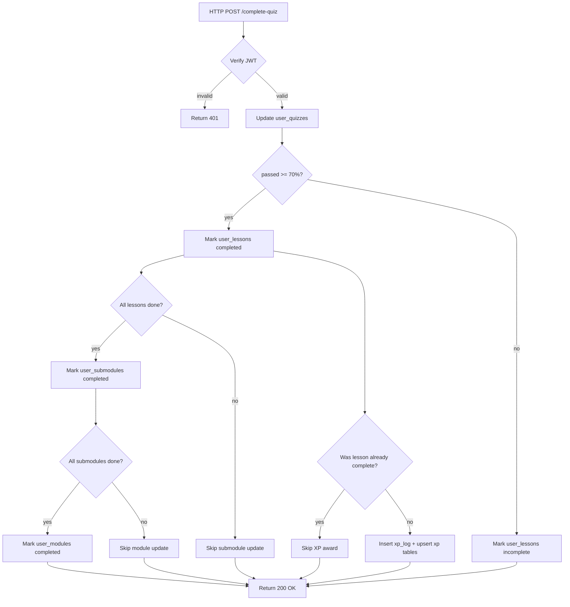
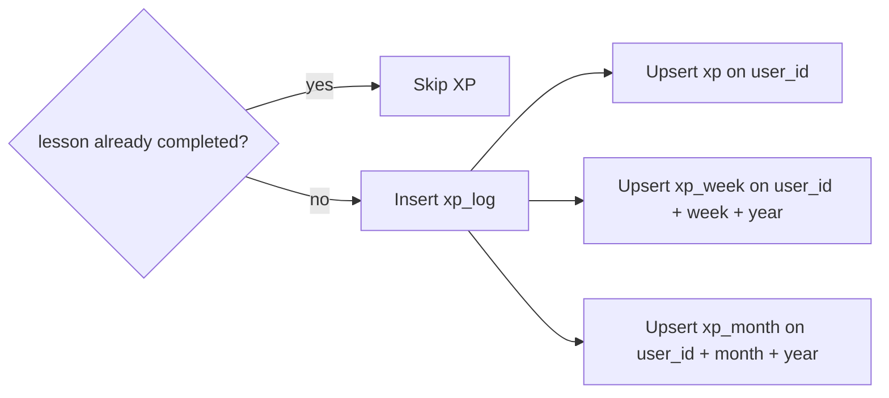
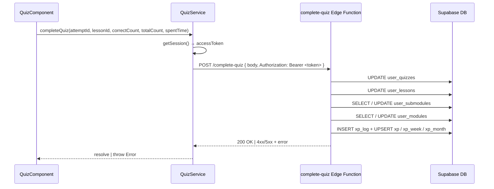
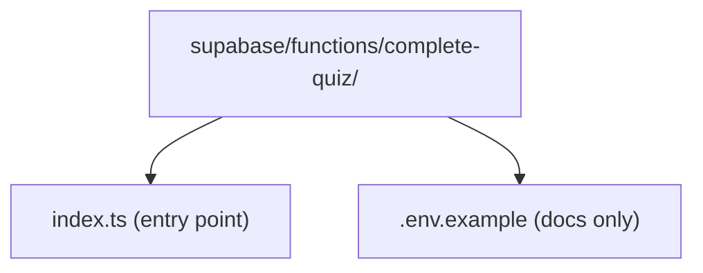
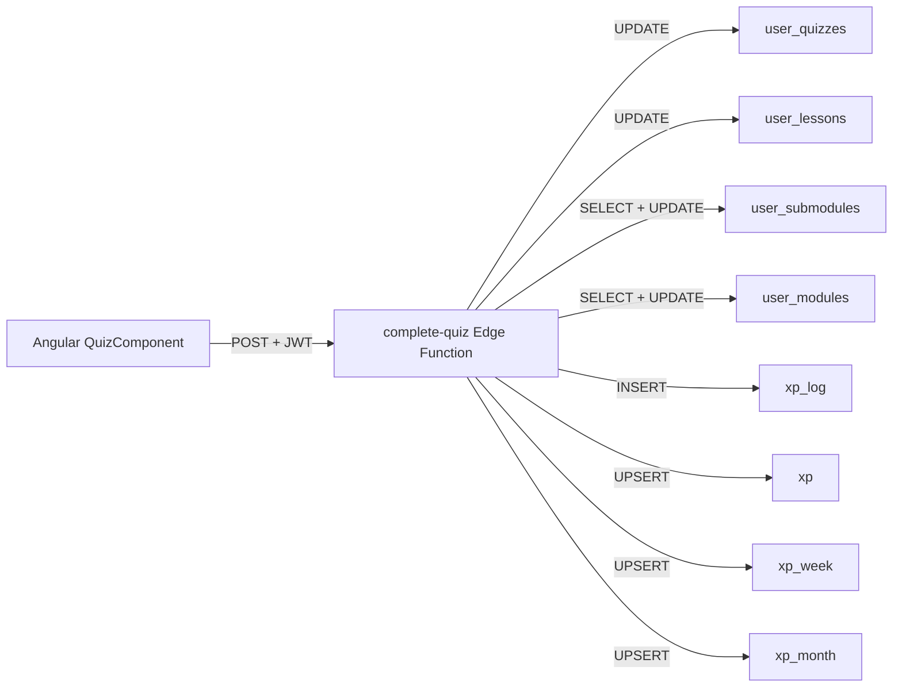

# Design Document

## Overview

The feature delegates all quiz-completion side effects to a single Supabase Edge Function called `complete-quiz`. This server-side boundary owns every write that flows from a completed quiz attempt: updating `user_quizzes`, marking `user_lessons`, cascading submodule and module completion checks, and crediting gamification XP. Moving this logic server-side prevents partial updates if the Angular client disconnects mid-flow and removes the need for multiple round-trips from the browser.

The Angular layer is kept thin. The existing `QuizComponent` already tracks the quiz attempt ID (created at quiz start via `UserQuizService.createAttempt`) and the elapsed time. When the user answers the last question, `QuizService.completeQuiz()` calls the Edge Function with the attempt ID, lesson ID, correct-answer count, and elapsed seconds. The client passes its Supabase session JWT so the Edge Function can resolve the caller's identity without trusting a user-supplied ID.

The Edge Function uses the Supabase `service_role` key internally to bypass RLS for cross-table reads (e.g., counting all lessons in a submodule across all users) while all writes are scoped strictly to the authenticated user returned from the JWT. No new database tables or schema migrations are required; the feature exclusively writes to existing tables.

### Change Type

new-feature

### Design Goals

1. Execute all completion side effects atomically on the server to prevent partial state.
2. Keep the Angular client to a single service method call with JWT authentication.
3. Award XP idempotently — guard against duplicate awards on quiz retry.
4. Cascade submodule and module completion automatically without client orchestration.

### References

- **REQ-1**: Persist Quiz Attempt Result
- **REQ-2**: Mark Lesson as Completed
- **REQ-3**: Cascade Submodule Completion
- **REQ-4**: Cascade Module Completion
- **REQ-5**: Award XP for Lesson Completion
- **REQ-6**: Angular Client Integration
- **REQ-7**: Edge Function Deployment Artifact

---

## System Architecture

### DES-1: `complete-quiz` Edge Function

The Edge Function is the single authoritative entry point for quiz completion. It accepts a JSON body with `{ attemptId, lessonId, correctCount, totalCount, spentTime }`, verifies the caller JWT, then runs the full completion pipeline in sequence. If any step throws, the function returns a 500 with the error message; the client can surface a toast and let the user retry.

The function uses two Supabase clients: one created from the caller's JWT (`supabase-js` with `Authorization` header) for writes that must be scoped to the authenticated user, and one using the service role key for reads that span all users (e.g., checking all lessons in a submodule, not just the ones the user started).

_Implements: REQ-1.1, REQ-1.2, REQ-1.3, REQ-2.1, REQ-2.2, REQ-3.1, REQ-3.2, REQ-3.3, REQ-4.1, REQ-4.2, REQ-4.3, REQ-5.1, REQ-5.2, REQ-5.3, REQ-5.4, REQ-5.5_

---

### DES-2: XP Upsert Strategy

XP is stored across three aggregation tables (`xp`, `xp_week`, `xp_month`). Each may or may not have an existing row for the user. The Edge Function uses `INSERT ... ON CONFLICT (user_id) DO UPDATE SET total_xp = total_xp + $amount` style upserts (via unique constraints on `user_id`, and composite keys for the period tables) to avoid race conditions and eliminate the read-then-write anti-pattern.

The idempotency guard reads `user_lessons.completed` **before** the update step. If the field is already `true`, the XP block is skipped entirely — ensuring a repeated quiz pass does not re-award XP.

_Implements: REQ-5.1, REQ-5.2, REQ-5.3, REQ-5.4, REQ-5.5_

---

### DES-3: Angular `QuizService.completeQuiz` Method

A new `completeQuiz` method is added to the existing `QuizService`. It retrieves the current Supabase session to extract the access token, then invokes the Edge Function via `supabase.functions.invoke('complete-quiz', ...)`. The method throws on error so the `QuizComponent` can handle failure. The existing `UserQuizService.finishAttempt` call in `quiz.ts` is replaced by this single call.

_Implements: REQ-6.1, REQ-6.2, REQ-6.3_

---

### DES-4: Edge Function File Structure

The function lives under `supabase/functions/complete-quiz/` following the Supabase CLI convention. A `.env.example` documents the required `SUPABASE_SERVICE_ROLE_KEY` secret. The actual secret is injected at deploy time via the Supabase dashboard or CLI secrets and is never committed to the repository. Local development uses the Supabase local stack where the service role key is derived automatically.

_Implements: REQ-7.1, REQ-7.2_

---

## Data Flow

The completion pipeline is a sequential, server-side orchestration with a single HTTP boundary between the Angular client and the Edge Function.

---

## Code Anatomy

| File Path | Purpose | Implements |
|-----------|---------|------------|
| `supabase/functions/complete-quiz/index.ts` | Deno Edge Function — full completion pipeline | DES-1, DES-2 |
| `supabase/functions/complete-quiz/.env.example` | Documents `SUPABASE_SERVICE_ROLE_KEY` and `SUPABASE_URL` | DES-4 |
| `src/app/services/quiz.ts` | Add `completeQuiz()` method; remove direct `UserQuizService.finishAttempt` call from component | DES-3 |
| `src/app/pages/app/quiz/quiz.ts` | Replace `userQuizService.finishAttempt(...)` with `quizService.completeQuiz(...)` | DES-3 |

---

## Error Handling

| Error Condition | Response | Recovery |
|-----------------|----------|----------|
| Missing or expired JWT | Edge Function returns 401 | Client redirects to login |
| Invalid body (missing required fields) | Edge Function returns 400 with field name | Client surfaces validation error |
| DB write failure (network or constraint) | Edge Function returns 500 with error message | Client shows retry toast; state remains partially written |
| XP upsert conflict already handled by ON CONFLICT | No error | Idempotent, transparent to client |
| `QuizService.completeQuiz` network timeout | `supabase.functions.invoke` rejects | Component catches, shows error, quiz result screen still rendered |

---

## Impact Analysis

| Affected Area | Impact Level | Notes |
|---------------|--------------|-------|
| `src/app/services/quiz.ts` | Medium | New public method added; no existing methods removed |
| `src/app/pages/app/quiz/quiz.ts` | Low | `finishAttempt` call replaced; component model unchanged |
| `src/app/services/user-quiz.ts` | None | `finishAttempt` becomes unused; can be deprecated later |

### Breaking Changes

None. `UserQuizService.finishAttempt` is left in place; only the call site in `quiz.ts` is updated.

### Dependencies

| Dependency | Type | Impact |
|------------|------|--------|
| Supabase Edge Runtime (Deno 2) | Runtime | Already enabled in `config.toml` (`deno_version = 2`) |
| `SUPABASE_SERVICE_ROLE_KEY` secret | Deploy-time | Must be configured in Supabase dashboard for production |

### Testing Requirements

| Test Type | Coverage Goal | Notes |
|-----------|---------------|-------|
| Manual | Happy path: pass quiz, verify all 8 tables updated | Run locally with Supabase local stack |
| Manual | Fail path: <70%, verify `completed = false`, no XP rows | Check Studio or `psql` |
| Manual | Retry path: pass same quiz twice, verify XP not doubled | Select `xp_log` count for user |

---

## Traceability Matrix

| Design Element | Requirements |
|----------------|--------------|
| DES-1 | REQ-1.1, REQ-1.2, REQ-1.3, REQ-2.1, REQ-2.2, REQ-3.1, REQ-3.2, REQ-3.3, REQ-4.1, REQ-4.2, REQ-4.3, REQ-5.1, REQ-5.5 |
| DES-2 | REQ-5.1, REQ-5.2, REQ-5.3, REQ-5.4, REQ-5.5 |
| DES-3 | REQ-6.1, REQ-6.2, REQ-6.3 |
| DES-4 | REQ-7.1, REQ-7.2 |
