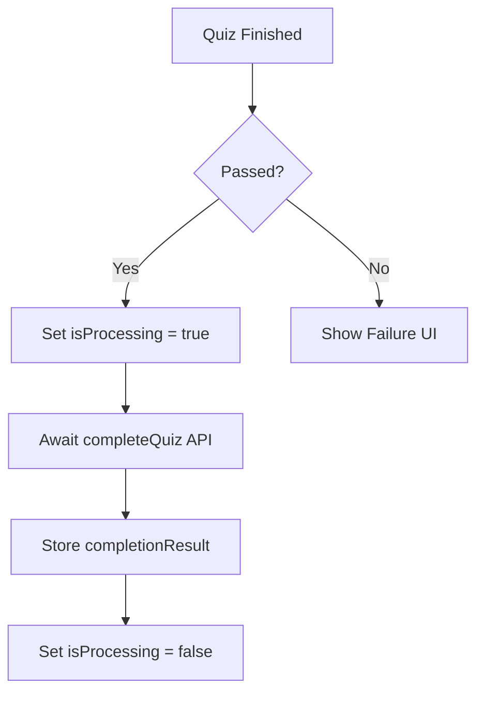
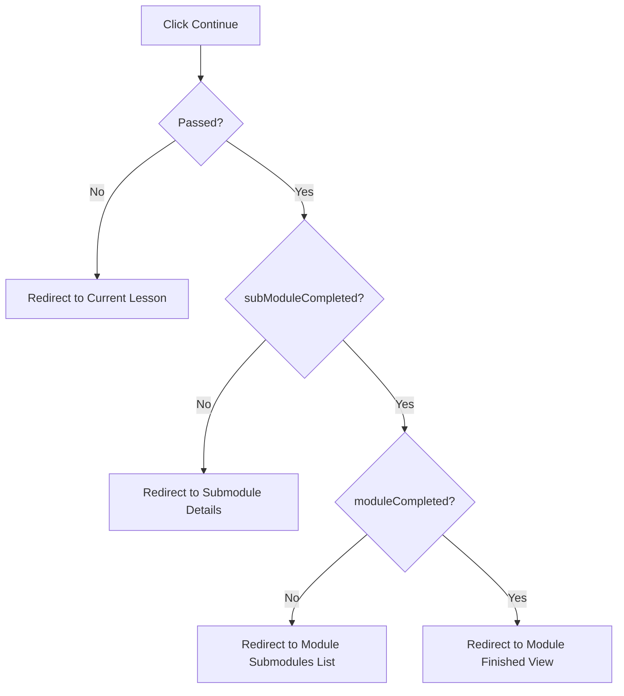

# Design Document

## Overview

This document outlines the technical design for updating the "Continue" button redirection logic on the quiz completion screen. The update handles unsuccessful quiz attempts by routing back to the lesson, and successful attempts by navigating based on progress data returned by the backend (submodule or module completion status). It also introduces a loading state to prevent premature navigation while backend processing occurs.

### Change Type

enhancement

### Design Goals

1. Seamlessly redirect users to the most appropriate next step based on their quiz performance and overall learning progress.
2. Prevent user navigation during backend processing by implementing a robust loading state.

### References

- **REQ-1**: Unsuccessful Quiz Redirection
- **REQ-2**: Quiz Completion Processing State
- **REQ-3**: Successful Quiz Redirections

## System Architecture

### DES-1: Quiz Completion State Management

To track the API request and its outcome, `QuizComponent` will introduce two new reactive signals: `isProcessingCompleteQuiz` and `quizCompletionResult`. The `finishQuiz()` method will update these signals while awaiting `quizService.completeQuiz(...)`.

_Implements: REQ-2.1, REQ-2.2_

### DES-2: Conditional Redirection Logic

The `quiz.html` template will bind the "Continue" button's disabled state to `isProcessingCompleteQuiz`. When clicked, it will invoke a new `continueQuiz()` method. For unsuccessful attempts, this method routes the user back to the current lesson. For successful attempts, it evaluates the `quizCompletionResult` payload to determine the target route.

_Implements: REQ-1.1, REQ-3.1, REQ-3.2, REQ-3.3_

## Code Anatomy

| File Path | Purpose | Implements |
|-----------|---------|------------|
| src/app/pages/app/quiz/quiz.ts | Component logic for state tracking and conditional routing. | DES-1, DES-2 |
| src/app/pages/app/quiz/quiz.html | Template bindings for loading states and button clicks. | DES-1, DES-2 |

## Traceability Matrix

| Design Element | Requirements |
|----------------|--------------|
| DES-1 | REQ-2.1, REQ-2.2 |
| DES-2 | REQ-1.1, REQ-3.1, REQ-3.2, REQ-3.3 |
