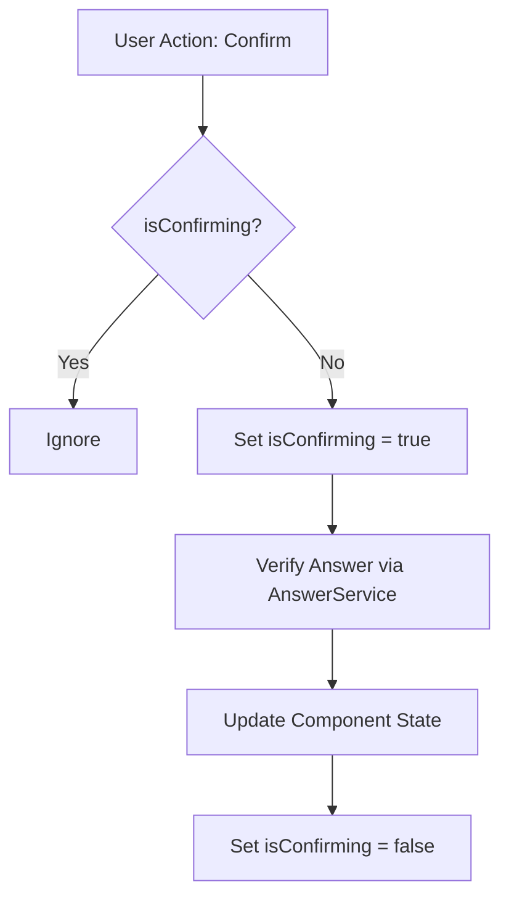
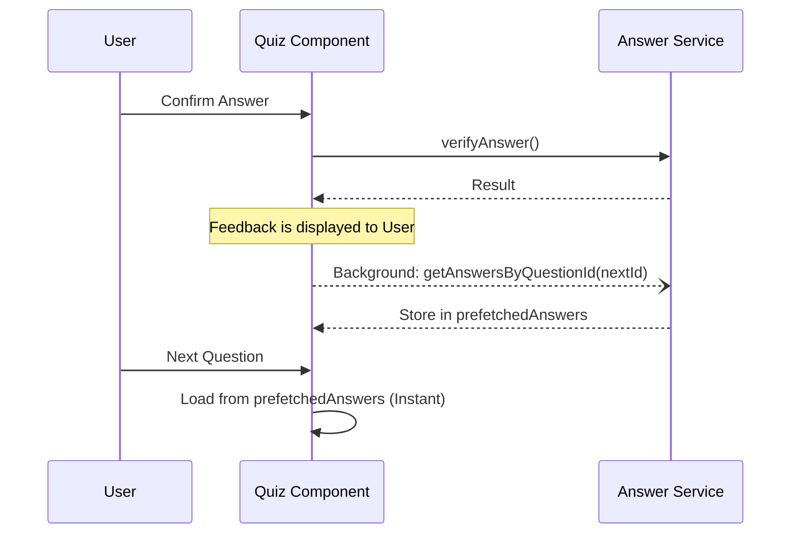
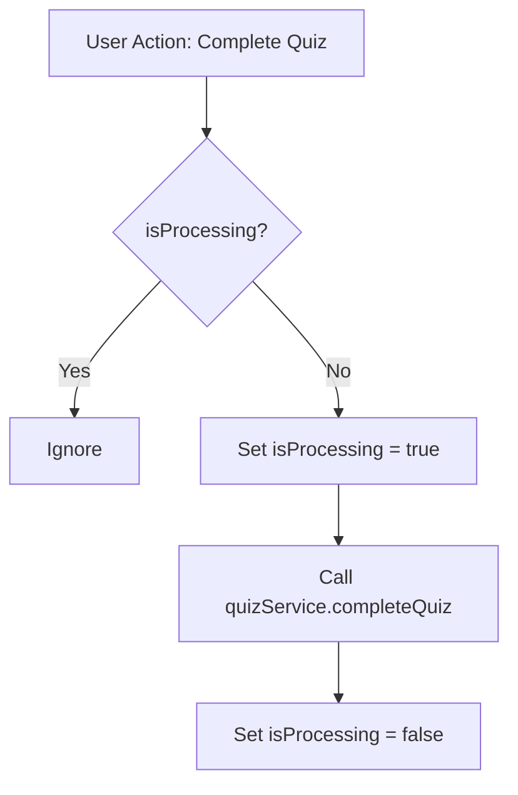

# Design Document

## Overview

The quiz component currently suffers from race conditions where users double-clicking or rapidly pressing "Enter" can cause the same answer or completion action to be submitted multiple times. Furthermore, question transitions are slow because the application waits for a network round-trip to fetch the next set of answers only after the user navigates. 

This change introduces in-flight guards (via Signals) to block duplicate asynchronous calls, and implements a background prefetching mechanism that loads the next question's answers while the user is reading the feedback for their current answer.

### Change Type

enhancement

### Design Goals

1. Prevent duplicate answer submissions and quiz completion calls via explicit state guards.
2. Make question transitions feel instantaneous by prefetching the next question's answers without exposing the entire quiz dataset upfront.

### References

- **REQ-1**: In-flight Guard for Answer Confirmation
- **REQ-2**: Background Prefetch of Next Question's Answers
- **REQ-3**: In-flight Guard for Quiz Completion

## System Architecture

### DES-1: Confirmation In-flight Guard

An `isConfirming` signal will be added to the `Quiz` component to track the execution state of `confirmAnswer()`. This flag will be checked at the start of the method and in the `handleKeyboardEvent` listener to ignore duplicate triggers. The button in the template will be bound to this signal to render a loading or disabled state.

_Implements: REQ-1.1, REQ-1.2, REQ-1.3, REQ-1.4_

### DES-2: Background Answer Prefetcher

After a successful answer confirmation, if there is a subsequent question, a background task will initiate to fetch its answers. A `prefetchedAnswers` signal will hold the cached result (mapped by question ID). When the user navigates to the next question, `loadAnswersForCurrentQuestion()` will first check this cache and use it immediately, falling back to a standard network request if the cache is empty or the prefetch failed.

_Implements: REQ-2.1, REQ-2.2, REQ-2.3, REQ-2.4_

### DES-3: Completion In-flight Guard

The existing `isProcessingCompleteQuiz` signal (or a dedicated completion guard) will strictly wrap the final `finishQuiz()` and `continueQuiz()` logic. Event listeners in `next()` and keyboard handlers will verify this flag before invoking completion logic.

_Implements: REQ-3.1, REQ-3.2, REQ-3.3_

## Code Anatomy

| File Path | Purpose | Implements |
|-----------|---------|------------|
| src/app/pages/app/quiz/quiz.ts | State management for guards and prefetching logic | DES-1, DES-2, DES-3 |
| src/app/pages/app/quiz/quiz.html | Template bindings for disabled states and loading indicators | DES-1, DES-3 |

## Traceability Matrix

| Design Element | Requirements |
|----------------|--------------|
| DES-1 | REQ-1.1, REQ-1.2, REQ-1.3, REQ-1.4 |
| DES-2 | REQ-2.1, REQ-2.2, REQ-2.3, REQ-2.4 |
| DES-3 | REQ-3.1, REQ-3.2, REQ-3.3 |
