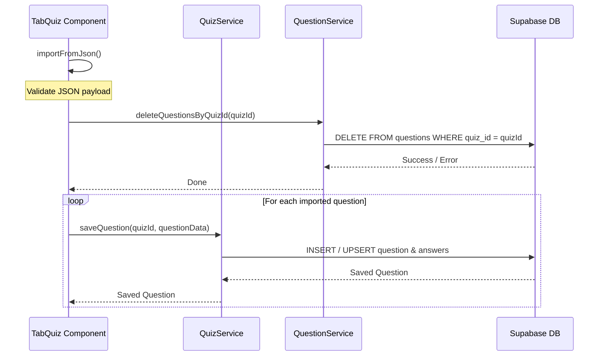
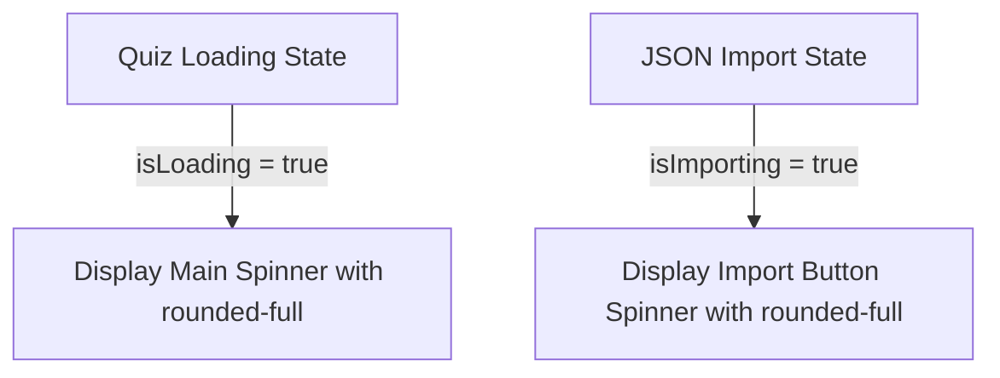

# Design Document

## Overview
This design document describes the technical adjustments for the quiz JSON import process. Before storing new imported questions, any existing questions linked to the current quiz will be cleared from the database. Furthermore, loader indicators will be updated to display as circles instead of squares.

### Change Type
enhancement

### Design Goals
1. Clear existing questions for the active quiz prior to persisting the JSON import payload.
2. Render loading indicators in the quiz tab and JSON import buttons as circular elements using modern CSS styling.

### References
- **REQ-1**: Clear Existing Questions Before JSON Import
- **REQ-2**: Circular Loading Spinner Icons

## System Architecture

### DES-1: Quiz Question Deletion API

This design element introduces a deletion method in `QuestionService` that deletes all questions associated with a given `quiz_id`. In the component logic, this deletion operation runs as the first step of the JSON import sequence, prior to bulk persisting the new question set. Due to database CASCADE DELETE constraints on foreign keys, clearing the questions automatically cascades to delete associated answers and section content.

_Implements: REQ-1.1_

### DES-2: Circular Loading Spinner Styles

This design element defines the correct styling rules for visual spinners. To prevent spinners from appearing as squares, the default square dimensions must be rounded completely using Tailwind's `rounded-full` class. This styling is applied to both the main page-level loader and the inline modal action button loader.

_Implements: REQ-2.1, REQ-2.2_

## Code Anatomy

| File Path | Purpose | Implements |
|-----------|---------|------------|
| src/app/services/question.ts | Exposes the method to delete questions by quiz ID. | DES-1 |
| src/app/pages/professor/professor-app/create-lesson/tab-quiz/tab-quiz.ts | Integrates deletion call into `importFromJson` sequence. | DES-1 |
| src/app/pages/professor/professor-app/create-lesson/tab-quiz/tab-quiz.html | Adjusts loader styling to include circular properties. | DES-2 |

## Impact Analysis

| Affected Area | Impact Level | Notes |
|---------------|--------------|-------|
| src/app/services/question.ts | Low | New method introduced; backward compatible. |
| src/app/pages/professor/professor-app/create-lesson/tab-quiz/tab-quiz.ts | Medium | Modification to import sequence; changes behavior to drop existing questions. |
| src/app/pages/professor/professor-app/create-lesson/tab-quiz/tab-quiz.html | Low | Layout and class tweaks for loaders. |

### Testing Requirements

| Test Type | Coverage Goal | Notes |
|-----------|---------------|-------|
| Unit | Delete Method | Verify `QuestionService.deleteQuestionsByQuizId` correctly targets quiz_id. |
| Integration | Import Flow | Verify that importing questions clears previous questions before saving new ones. |

## Traceability Matrix

| Design Element | Requirements |
|----------------|--------------|
| DES-1 | REQ-1.1 |
| DES-2 | REQ-2.1, REQ-2.2 |
