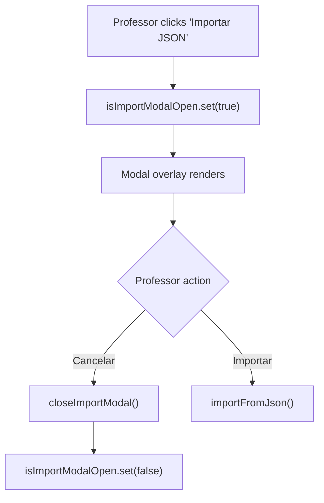
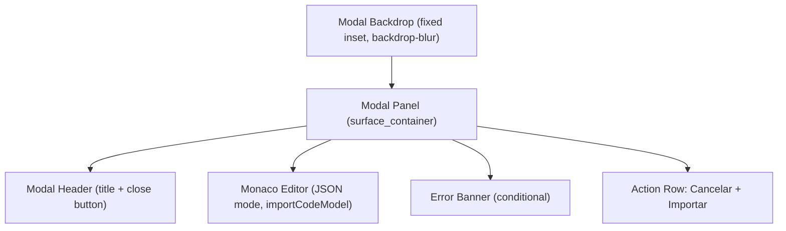
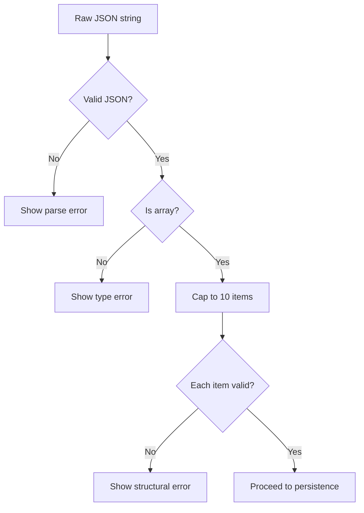
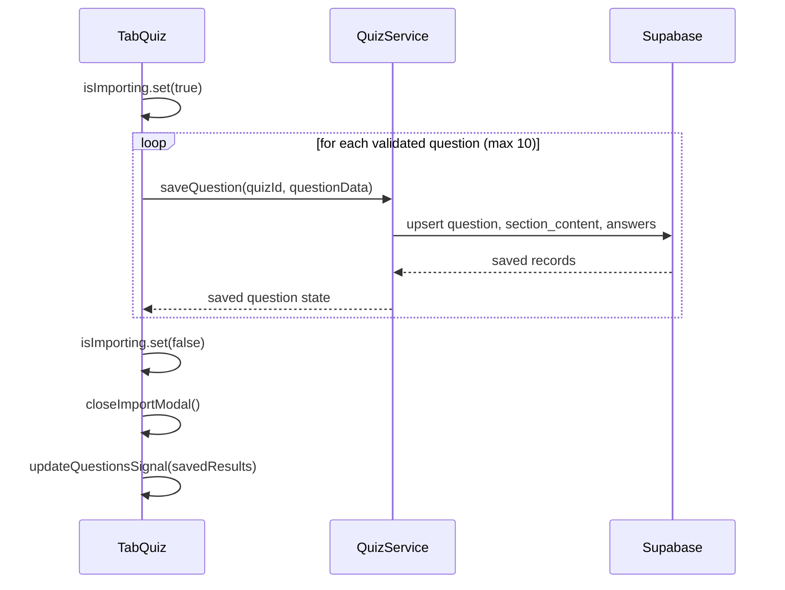
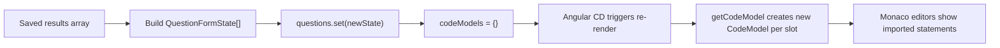
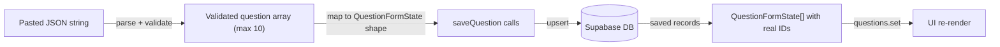
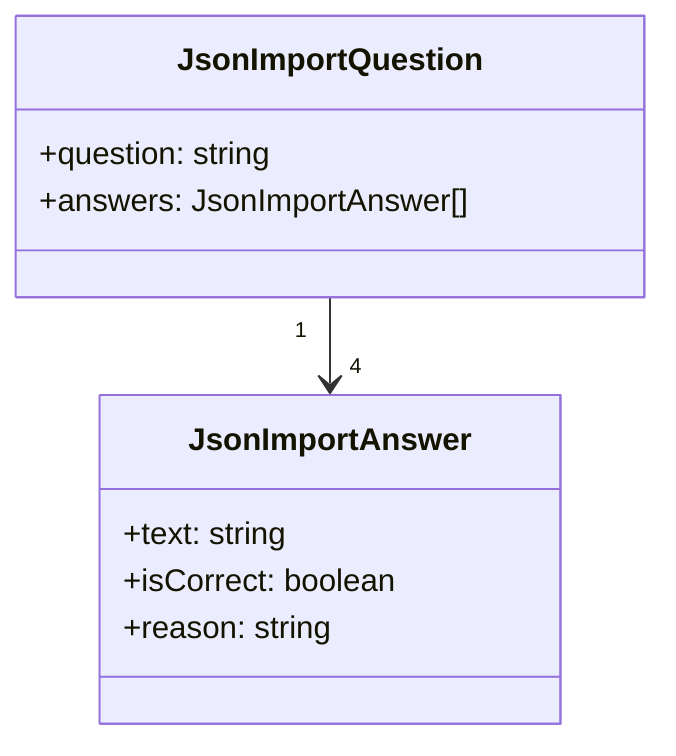

# Design Document

## Overview

The quiz JSON import feature is implemented as a self-contained interaction entirely within the `TabQuiz` component. No new services are created; the feature reuses the existing `QuizService.saveQuestion` persistence path and the already-provisioned `@ngstack/code-editor` (Monaco) dependency.

A boolean signal in `TabQuiz` drives modal visibility. When the modal is open, a separate `CodeModel` (JSON mode) is bound to a Monaco editor instance inside the modal overlay. Validation, capping, and sequential persistence all happen inside a single `importFromJson` method on the component. After all questions are successfully saved, the component resets its `questions` signal and `codeModels` record to reflect the new data, achieving post-import state consistency without a page reload.

The modal follows the existing glassmorphic overlay pattern (backdrop blur, `surface_container` panel, `@modalAnimation` / `@overlayAnimation` Angular animations) established by `NewsletterModal` and `AchievementModalComponent`.

### Change Type

new-feature

### Design Goals

1. Reuse existing `QuizService.saveQuestion` so no new Supabase surface is exposed.
2. Keep the modal co-located inside `TabQuiz` (no new standalone component) to avoid unnecessary indirection for a single-use overlay.
3. Provide clear, in-modal validation feedback before any database writes are attempted.
4. Reset Monaco `codeModels` correctly after import so the question statement editors reflect imported content.

### References

- **REQ-1**: Import JSON Button on Quiz Header
- **REQ-2**: JSON Import Modal with Code Editor
- **REQ-3**: JSON Payload Validation
- **REQ-4**: Question Count Capping and Slot Filling
- **REQ-5**: Bulk Persist Imported Questions to Database
- **REQ-6**: Post-Import State Consistency

---

## System Architecture

### DES-1: Import Button and Modal Visibility Control

`TabQuiz` gains an `isImportModalOpen` signal (boolean). The "Importar JSON" button in the quiz header sets this signal to `true`. A `closeImportModal()` method sets it to `false` and resets the modal-local state (JSON content, error, import progress).

_Implements: REQ-1.1, REQ-1.2, REQ-2.2, REQ-2.3_

---

### DES-2: JSON Modal Layout with Monaco Editor

The modal follows the established glassmorphic overlay structure: a full-screen backdrop with `backdrop-blur` and a centered panel using `surface_container` background. Inside the panel, a Monaco editor instance is bound to `importCodeModel` (a `CodeModel` with `language: 'json'`). The editor occupies the bulk of the modal body so that the professor has enough vertical space to review the JSON.

_Implements: REQ-2.1, REQ-2.2, REQ-2.3_

---

### DES-3: Client-Side JSON Validation

`importFromJson()` performs a sequential validation guard before any persistence:

1. Parse the raw string via `JSON.parse`; catch `SyntaxError` → show "JSON inválido".
2. Assert `Array.isArray(parsed)` → show "O payload deve ser um array JSON".
3. For each item (up to 10): assert `item.question` is a non-empty string and `item.answers` is an array with exactly 4 elements → show "Questão N: campo obrigatório ausente".
4. For each answer: assert `text`, `isCorrect`, and `reason` are present → show "Questão N, Alternativa M: campo obrigatório ausente".

Only if all guards pass does the method proceed to persistence.

_Implements: REQ-3.1, REQ-3.2, REQ-3.3, REQ-3.4, REQ-4.1, REQ-4.2_

---

### DES-4: Sequential Bulk Persistence

`importFromJson()` iterates the validated (capped) question array and calls `QuizService.saveQuestion` for each item sequentially using `await` inside a `for` loop. The `isImporting` signal is set to `true` before the loop and `false` in a `finally` block. If any call throws, the method catches the error, sets `importError` to a per-question message, and returns early without closing the modal.

_Implements: REQ-5.1, REQ-5.2, REQ-5.3, REQ-5.4_

---

### DES-5: Post-Import In-Memory State Reset

After all questions are persisted, `importFromJson()` constructs a fresh `QuestionFormState[]` from the saved results (using the same shape as `loadQuiz`) and calls `this.questions.set(newState)`. The `codeModels` record is reset to `{}` so that on the next render cycle the `getCodeModel` method creates new `CodeModel` instances populated with the imported statement text, causing Monaco to display the new content correctly.

_Implements: REQ-6.1, REQ-6.2_

---

## Data Flow

---

## Data Models

The import payload is typed internally as `JsonImportQuestion[]` (not persisted to DB, used only within `importFromJson`):

No database schema changes are required.

---

## Error Handling

| Error Condition | Response | Recovery |
|---|---|---|
| `JSON.parse` throws `SyntaxError` | Set `importError` to "JSON inválido. Verifique a sintaxe." | Professor corrects JSON in editor |
| Parsed value is not an array | Set `importError` to "O payload deve ser um array de questões." | Professor corrects JSON |
| Missing `question` or wrong `answers` length | Set `importError` to "Questão N: estrutura inválida." | Professor corrects JSON |
| Missing answer fields | Set `importError` to "Questão N, Alternativa M: campo obrigatório ausente." | Professor corrects JSON |
| `QuizService.saveQuestion` throws | Set `importError` to "Erro ao salvar a questão N. Tente novamente." | Professor retries without losing JSON content |

---

## Code Anatomy

| File Path | Purpose | Implements |
|---|---|---|
| `src/app/pages/professor/professor-app/create-lesson/tab-quiz/tab-quiz.ts` | Adds `isImportModalOpen`, `isImporting`, `importCodeModel`, `importError` signals; adds `openImportModal()`, `closeImportModal()`, `importFromJson()` methods; resets `codeModels` after import | DES-1, DES-3, DES-4, DES-5 |
| `src/app/pages/professor/professor-app/create-lesson/tab-quiz/tab-quiz.html` | Adds "Importar JSON" button in header; adds modal overlay markup with Monaco editor, error banner, and action buttons | DES-1, DES-2 |

---

## Traceability Matrix

| Design Element | Requirements |
|---|---|
| DES-1 | REQ-1.1, REQ-1.2, REQ-2.2, REQ-2.3 |
| DES-2 | REQ-2.1, REQ-2.2, REQ-2.3 |
| DES-3 | REQ-3.1, REQ-3.2, REQ-3.3, REQ-3.4, REQ-4.1, REQ-4.2 |
| DES-4 | REQ-5.1, REQ-5.2, REQ-5.3, REQ-5.4 |
| DES-5 | REQ-6.1, REQ-6.2 |
