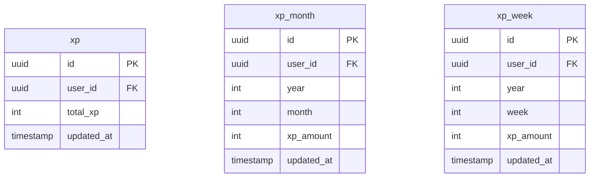
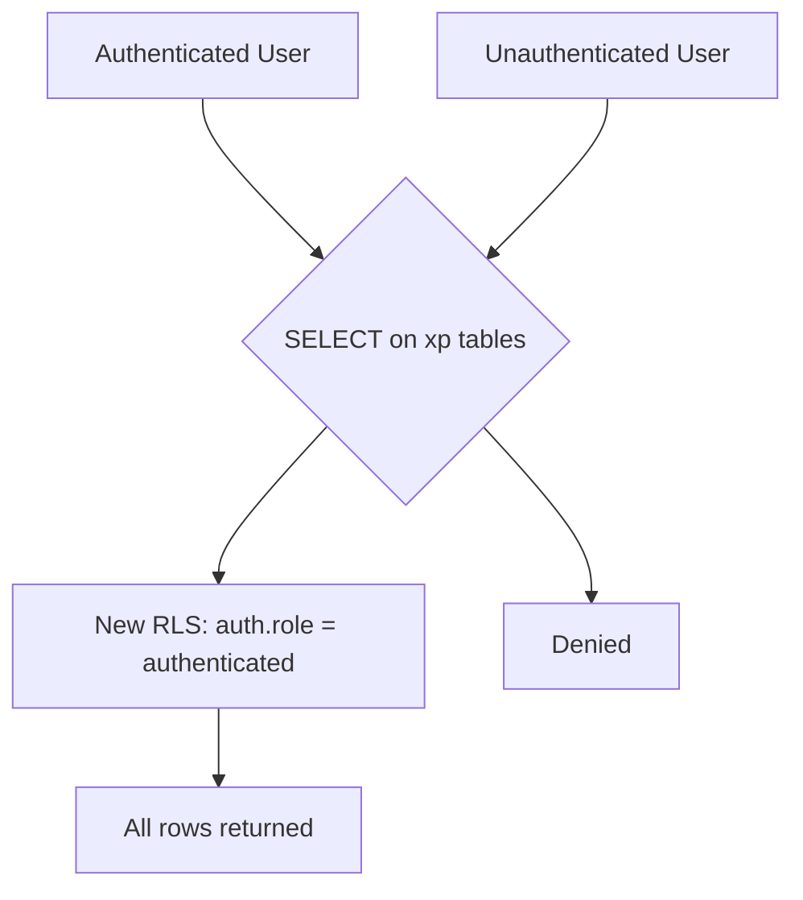
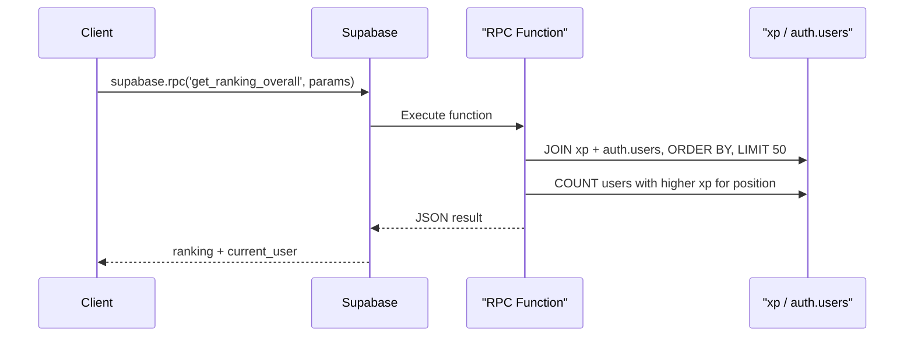
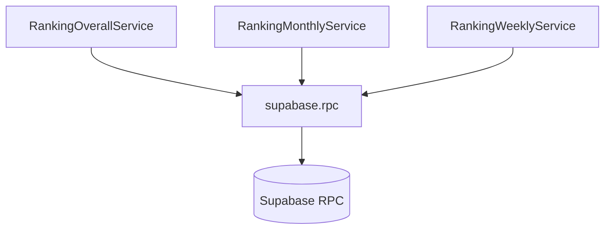
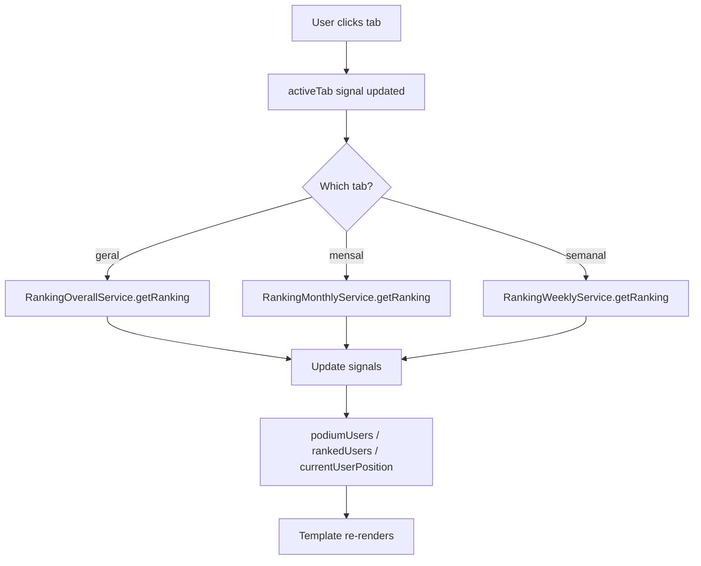
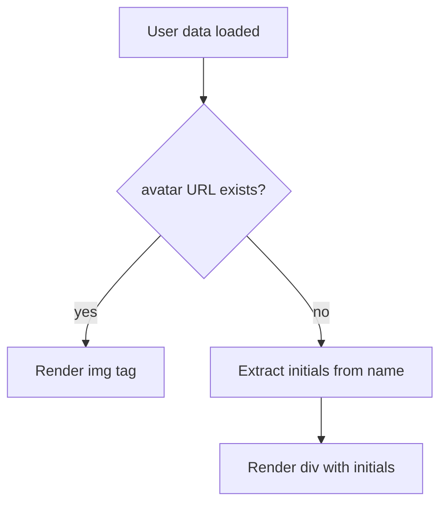
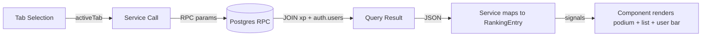
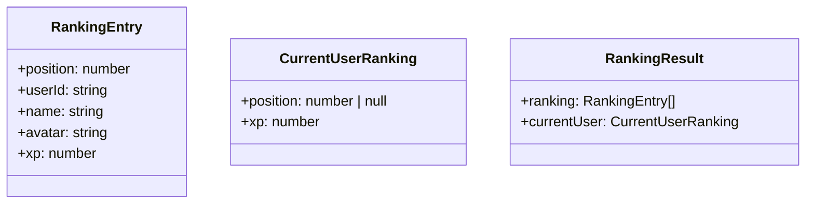

# Design Document

## Overview

This design transforms the static ranking screen into a dynamic, data-driven leaderboard. The approach uses three dedicated Postgres RPC functions (one per ranking view) to perform the heavy lifting of joining XP data with `auth.users` metadata, ordering, and calculating the current user's position — all server-side. On the Angular side, three new services (one per ranking view) encapsulate the Supabase calls, and the `Ranking` component orchestrates tab selection, loading states, and data binding using signals.

Database changes include adding an `updated_at` column to all three XP tables with an automatic trigger, broadening RLS policies for authenticated reads, and creating the RPC functions. The existing `XpService` is not modified; the new ranking services are purpose-built for leaderboard queries.

### Change Type

new-feature

### Design Goals

1. Offload ranking computation (ordering, tiebreaking, position counting) to Postgres RPC functions for performance and correctness.
2. Keep each ranking view mode isolated in its own service for clean separation of concerns.
3. Reuse the existing UI layout and design system tokens while making the template fully data-driven.
4. Minimize client-side complexity by returning pre-shaped ranking data from the database.

### References

- **REQ-1**: Ranking View Modes
- **REQ-2**: Ranking Data Retrieval
- **REQ-3**: Current User Position
- **REQ-4**: Podium Display
- **REQ-5**: Database Schema Update
- **REQ-6**: RLS Policy Update for Ranking Reads

## System Architecture

### DES-1: Database Schema and Trigger for updated_at

Add an `updated_at` column (type `timestamp without time zone`, default `now()`) to tables `xp`, `xp_month`, and `xp_week`. A shared trigger function `set_updated_at()` fires `BEFORE INSERT OR UPDATE` on each table, setting `updated_at = now()`. This ensures tiebreaker data is always populated without requiring application-level changes.

_Implements: REQ-5.1, REQ-5.2, REQ-5.3, REQ-5.4_

### DES-2: RLS Policy Broadening

Replace the existing row-owner-only SELECT policies on `xp`, `xp_month`, and `xp_week` with policies that allow any authenticated user to SELECT all rows. Write policies remain unchanged (controlled by existing service-role or Edge Function logic).

_Implements: REQ-6.1, REQ-6.2, REQ-6.3, REQ-6.4_

### DES-3: Postgres RPC Functions for Ranking

Three RPC functions encapsulate the ranking logic server-side. Each function joins its XP table with `auth.users` to extract `raw_user_meta_data->>'name'` and `raw_user_meta_data->>'avatar'`, orders by XP descending and `updated_at` ascending, limits to 50 rows, and returns both the ranked list and the calling user's position.

- `get_ranking_overall(p_user_id uuid)` — queries `xp` ordered by `total_xp DESC, updated_at ASC`
- `get_ranking_monthly(p_user_id uuid, p_year int, p_month int)` — queries `xp_month` filtered by year/month, ordered by `xp_amount DESC, updated_at ASC`
- `get_ranking_weekly(p_user_id uuid, p_year int, p_week int)` — queries `xp_week` filtered by year/week, ordered by `xp_amount DESC, updated_at ASC`

Each function returns a JSON object with two keys: `ranking` (array of top 50 entries with position, user_id, name, avatar, xp) and `current_user` (object with position and xp for the calling user).

_Implements: REQ-2.1, REQ-2.2, REQ-2.3, REQ-2.4, REQ-3.2, REQ-3.3, REQ-3.4_

### DES-4: Angular Ranking Services

Three new Angular services follow the established codebase pattern (injectable, `providedIn: 'root'`, private `SupabaseClient`):

- `RankingOverallService` — calls `get_ranking_overall` RPC
- `RankingMonthlyService` — calls `get_ranking_monthly` RPC with current year/month
- `RankingWeeklyService` — calls `get_ranking_weekly` RPC with current year/ISO-week

Each service exposes a single async method that returns a typed `RankingResult` containing the top 50 entries and the current user's position data.

_Implements: REQ-2.1, REQ-2.2, REQ-2.3_

### DES-5: Ranking Component Orchestration

The `Ranking` component manages tab state via a signal (`activeTab: 'geral' | 'mensal' | 'semanal'`). On tab change or initial load, it calls the corresponding service, populates signals for `podiumUsers` (top 3), `rankedUsers` (positions 4–50), `currentUserPosition`, and `isLoading`. The template uses `@if` / `@for` control flow to render dynamic data, replacing all hardcoded HTML.

The three filter buttons become Geral, Mensal, Semanal with active state styling driven by the `activeTab` signal.

_Implements: REQ-1.1, REQ-1.2, REQ-1.3, REQ-1.4, REQ-1.5, REQ-3.1, REQ-3.5, REQ-4.1, REQ-4.2_

### DES-6: Avatar Placeholder with Initials

When a user has no avatar URL (empty string or null in `raw_user_meta_data`), the template renders a circular div with the user's initials extracted from their display name (first letter of first and last name). This applies to both the podium section, ranking list, and the current user bar.

_Implements: REQ-2.5_

## Data Flow

## Data Models

## Code Anatomy

| File Path | Purpose | Implements |
|-----------|---------|------------|
| Migration: `add_updated_at_to_xp_tables` | Adds `updated_at` column and trigger to `xp`, `xp_month`, `xp_week` | DES-1 |
| Migration: `update_xp_rls_for_ranking` | Replaces owner-only SELECT policies with authenticated-read policies | DES-2 |
| Migration: `create_ranking_rpc_functions` | Creates `get_ranking_overall`, `get_ranking_monthly`, `get_ranking_weekly` RPCs | DES-3 |
| `src/models/ranking/ranking.ts` | `RankingEntry`, `CurrentUserRanking`, `RankingResult` interfaces | DES-3, DES-4 |
| `src/app/services/ranking-overall.ts` | Service calling `get_ranking_overall` RPC | DES-4 |
| `src/app/services/ranking-monthly.ts` | Service calling `get_ranking_monthly` RPC | DES-4 |
| `src/app/services/ranking-weekly.ts` | Service calling `get_ranking_weekly` RPC | DES-4 |
| `src/app/pages/app/ranking/ranking.ts` | Component orchestrating tab state, service calls, and signals | DES-5 |
| `src/app/pages/app/ranking/ranking.html` | Dynamic template with `@if`/`@for`, podium, list, user bar | DES-5, DES-6 |
| `src/models/xp/xp.ts` | Add `updatedAt` field to `XP` model | DES-1 |
| `src/models/xp-month/xp-month.ts` | Add `updatedAt` field to `XpMonth` model | DES-1 |
| `src/models/xp-week/xp-week.ts` | Add `updatedAt` field to `XpWeek` model | DES-1 |

## Error Handling

| Error Condition | Response | Recovery |
|-----------------|----------|----------|
| RPC call fails (network or DB error) | Display error message in the ranking section | User can retry by clicking the active tab again |
| Current user has no XP record | Display position "—" and XP "0" in the bottom bar | No recovery needed; expected state for new users |
| No users with XP in the selected period | Display empty state message (e.g., "Nenhum dado disponível") | No recovery needed; normal for new week/month |

## Impact Analysis

| Affected Area | Impact Level | Notes |
|---------------|--------------|-------|
| `xp` table schema | Medium | New column + trigger; existing data gets `updated_at = now()` on migration |
| `xp_month` table schema | Medium | Same as above |
| `xp_week` table schema | Medium | Same as above |
| RLS policies on XP tables | High | SELECT policies broadened from owner-only to all-authenticated |
| `src/models/xp/*.ts` | Low | New optional field added |
| `src/app/pages/app/ranking/*` | High | Full rewrite of component and template |

### Testing Requirements

| Test Type | Coverage Goal | Notes |
|-----------|---------------|-------|
| SQL validation | Verify RPC functions return correct shape | Run sample queries against Supabase |
| Component | Tab switching updates displayed data | Visual verification in dev server |
| Integration | End-to-end ranking with real XP data | Verify in browser with multiple user accounts |

### Risk Assessment

| Risk | Likelihood | Impact | Mitigation |
|------|------------|--------|------------|
| RLS broadening exposes unintended data | Low | Medium | Only SELECT is broadened; columns exposed are non-sensitive (user_id, xp amounts) |
| Trigger conflicts with Edge Function writes | Low | Medium | Trigger uses `BEFORE INSERT OR UPDATE` which is compatible with existing upsert logic |

## Traceability Matrix

| Design Element | Requirements |
|----------------|--------------|
| DES-1 | REQ-5.1, REQ-5.2, REQ-5.3, REQ-5.4 |
| DES-2 | REQ-6.1, REQ-6.2, REQ-6.3, REQ-6.4 |
| DES-3 | REQ-2.1, REQ-2.2, REQ-2.3, REQ-2.4, REQ-3.2, REQ-3.3, REQ-3.4 |
| DES-4 | REQ-2.1, REQ-2.2, REQ-2.3 |
| DES-5 | REQ-1.1, REQ-1.2, REQ-1.3, REQ-1.4, REQ-1.5, REQ-3.1, REQ-3.5, REQ-4.1, REQ-4.2 |
| DES-6 | REQ-2.5 |
