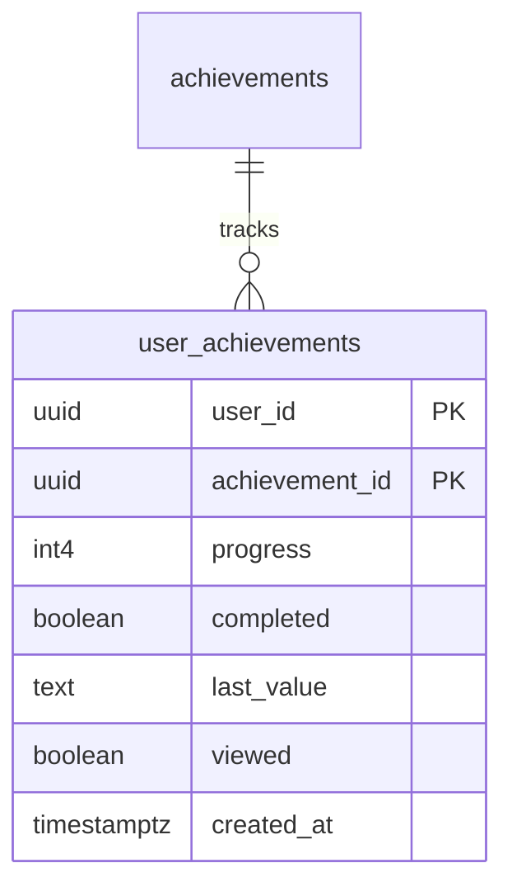
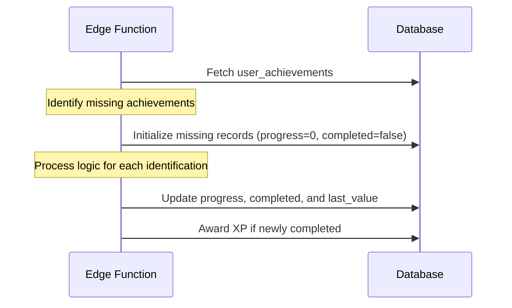
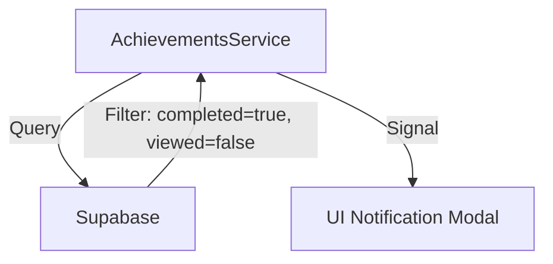
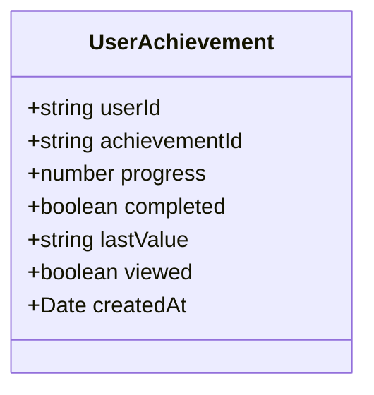

# Design Document

## Overview
The achievement system will be refactored to support persistent state tracking, enabling incremental updates for complex achievements like streaks and perfection milestones. This design involves evolving the database schema, refactoring the evaluation logic in the Supabase Edge Function, and updating the Angular service to filter notifications based on the new completion status.

### Change Type
refactoring

### Design Goals
1. Implement persistent progress tracking for achievements in the database.
2. Refactor achievement evaluation logic to use incremental updates instead of full history recalculation where possible.
3. Ensure all achievements are tracked for every user to provide a consistent progress experience.
4. Improve notification accuracy by decoupling completion from viewing status.

### References
- **REQ-1**: Persistent Achievement State Tracking
- **REQ-2**: Automatic Achievement Initialization
- **REQ-3**: Incremental Streak Achievement Logic
- **REQ-4**: Incremental Perfection Achievement Logic
- **REQ-5**: Lesson Improvement Achievement Logic
- **REQ-6**: Unseen Achievement Notifications

## System Architecture

### DES-1: Achievement State Persistence
The `user_achievements` table will be enhanced with fields to store the current progress, a boolean completion flag, and a metadata field for tracking the last qualifying event (e.g., a date).

_Implements: REQ-1.1, REQ-1.2_

### DES-2: Incremental Evaluation Engine
The Edge Function will be refactored to first ensure all achievement tracking records exist for the user. It will then apply specific rules for each achievement type, updating the existing records rather than just inserting new ones.

_Implements: REQ-2.1, REQ-3.1, REQ-3.2, REQ-3.3, REQ-3.4, REQ-3.5, REQ-4.1, REQ-4.2, REQ-4.3, REQ-4.4, REQ-5.1_

### DES-3: Filtered Notification Service
The Angular service will be updated to fetch only those achievements where `completed = true` and `viewed = false`. The frontend model will also be updated to reflect the new database fields.

_Implements: REQ-6.1_

## Code Anatomy

| File Path | Purpose | Implements |
|-----------|---------|------------|
| supabase/migrations/ | Database schema update for user_achievements table | DES-1 |
| supabase/functions/complete-quiz/achievements.ts | Refactored evaluation logic with initialization and incremental updates | DES-2 |
| src/models/user-achievement/user-achievement.ts | Updated model to include new state fields | DES-3 |
| src/app/services/achievements.ts | Updated query logic for unseen achievements | DES-3 |

## Data Models

## Impact Analysis

| Affected Area | Impact Level | Notes |
|---------------|--------------|-------|
| user_achievements table | High | Column additions; existing data needs to be migrated (set completed=true for existing records). |
| Edge Function | High | Significant logic change; needs to handle record existence checks. |
| Achievements UI | Medium | UI can now show progress bars if desired, though not requested yet. |

### Testing Requirements

| Test Type | Coverage Goal | Notes |
|-----------|---------------|-------|
| Integration | Achievement Granting | Verify that progress increments and completion triggers correctly in the Edge Function. |
| Integration | Initialization | Verify that missing user_achievements are created upon quiz completion. |
| Manual | Notification Flow | Verify that only completed achievements trigger the notification modal. |

## Traceability Matrix

| Design Element | Requirements |
|----------------|--------------|
| DES-1 | REQ-1.1, REQ-1.2 |
| DES-2 | REQ-2.1, REQ-3.1, REQ-3.2, REQ-3.3, REQ-3.4, REQ-3.5, REQ-4.1, REQ-4.2, REQ-4.3, REQ-4.4, REQ-5.1 |
| DES-3 | REQ-6.1 |
