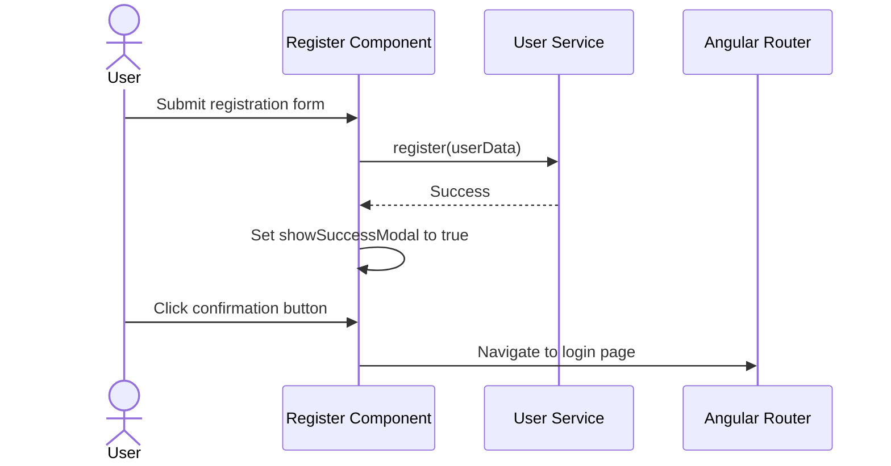

# Design Document

## Overview
This design outlines the enhancement to the registration page. When a user submits the registration form successfully, instead of redirecting immediately to the login page, the application will show a success modal. The modal informs the user that a verification email has been sent. When the user acknowledges the modal by clicking the button, they are redirected to the login page.

### Change Type
enhancement

### Design Goals
1. Provide clear user feedback upon successful registration.
2. Maintain the premium "Neon Terminal" glassmorphic UI design system guidelines.
3. Keep the registration flow simple and intuitive.

### References
- **REQ-1**: Registration Success Notification

## System Architecture

### DES-1: Registration Success Feedback Dialog

The Register component is updated to maintain the modal state using an Angular signal. When the registration form is submitted and the user registration service call returns successfully, the modal visibility signal is set to true. The modal uses a glassmorphic background styling.

_Implements: REQ-1.1, REQ-1.2, REQ-1.3_

## Code Anatomy

| File Path | Purpose | Implements |
|-----------|---------|------------|
| src/app/pages/register/register.ts | Component logic to handle form submission and display success modal | DES-1 |
| src/app/pages/register/register.html | Component template containing form and modal HTML | DES-1 |

## Impact Analysis

| Affected Area | Impact Level | Notes |
|---------------|--------------|-------|
| src/app/pages/register/register.ts | Low | Minor logic updates for success modal signal and navigation flow |
| src/app/pages/register/register.html | Low | Addition of Registration Success Modal UI |

### Testing Requirements

| Test Type | Coverage Goal | Notes |
|-----------|---------------|-------|
| Unit | Register Component tests | Verify signal is set to true on registration success, and navigation is called on button click |

## Traceability Matrix

| Design Element | Requirements |
|----------------|--------------|
| DES-1 | REQ-1.1, REQ-1.2, REQ-1.3 |
