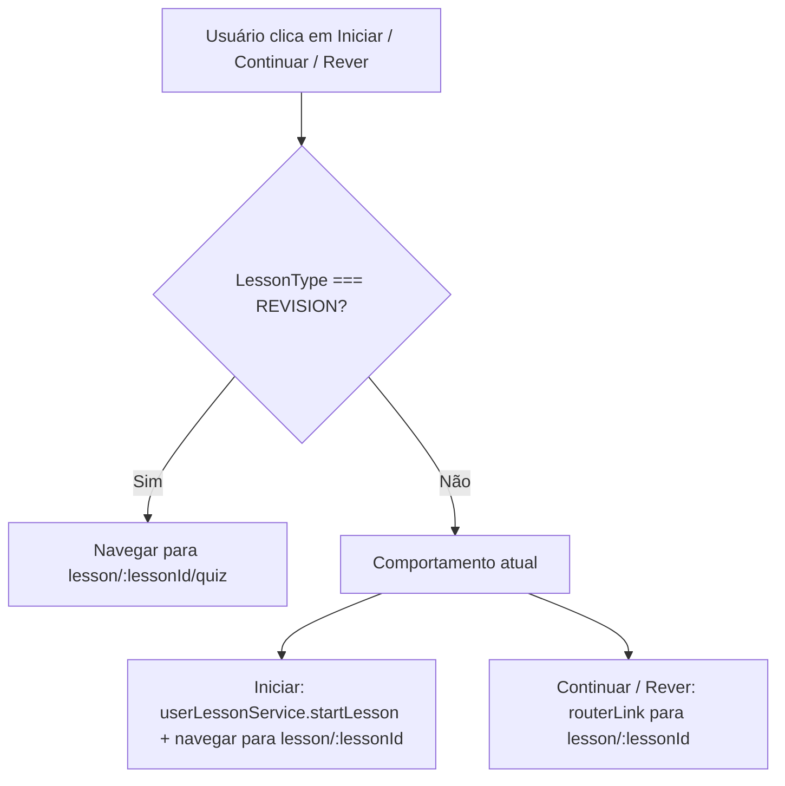
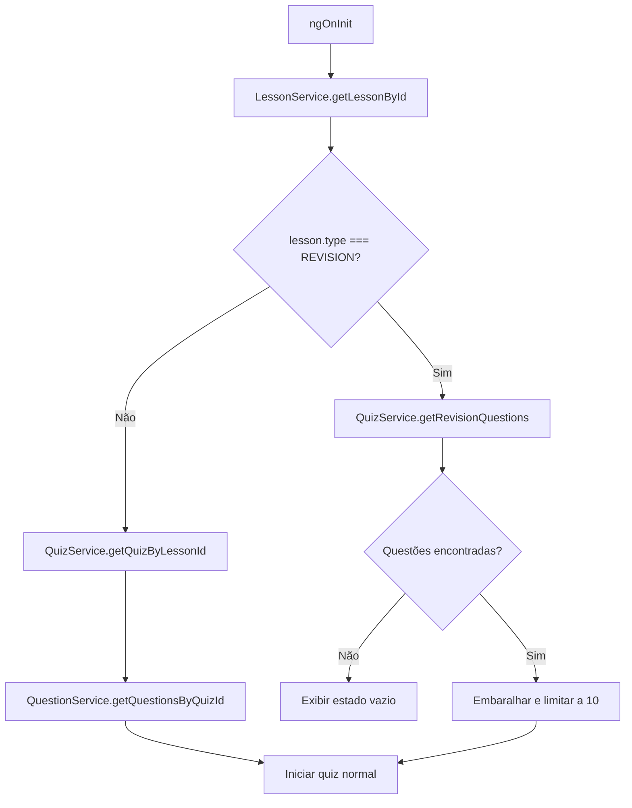
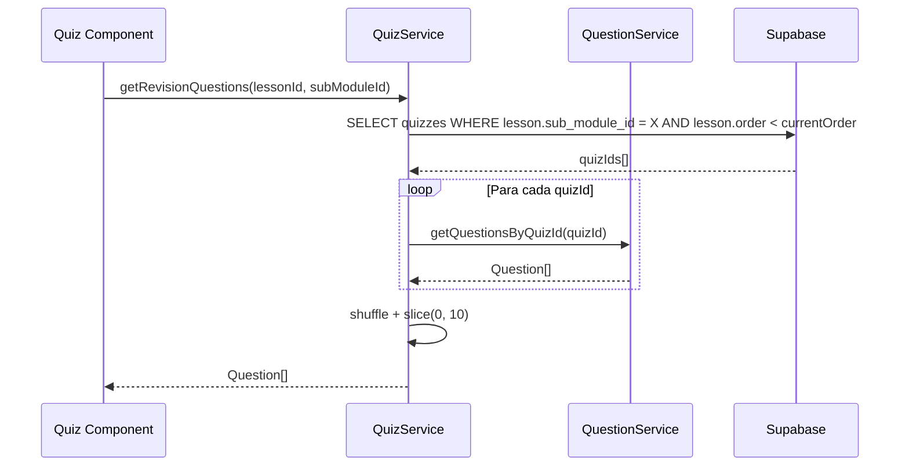
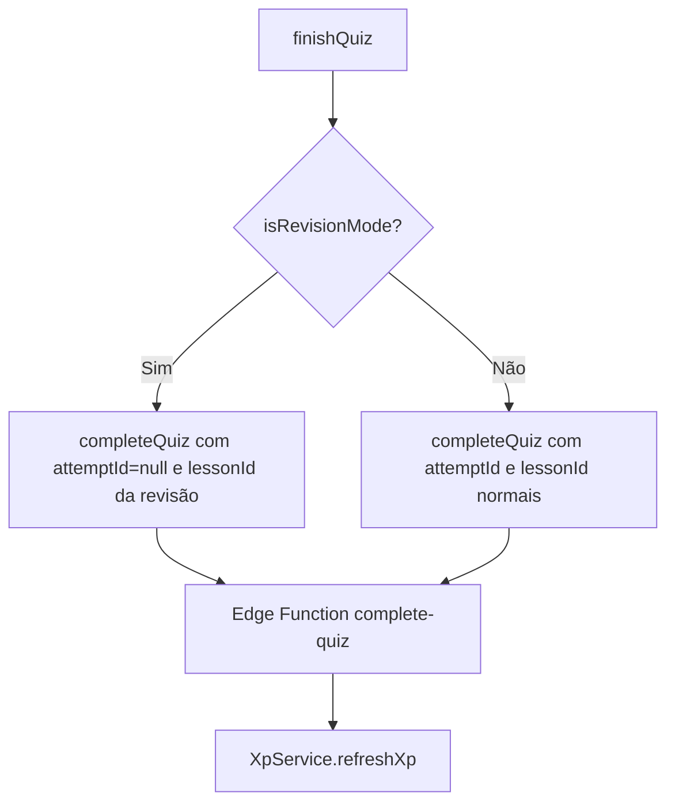

# Design Document

## Overview

Esta feature estende o fluxo existente de lições para suportar o tipo `REVISION`. A mudança é composta por duas partes independentes: (1) ajuste de roteamento no `SubmoduleDetail`, e (2) lógica diferenciada de carregamento de questões no componente `Quiz`.

O `SubmoduleDetail` já conhece o tipo de cada lição através do modelo `Lesson`. A alteração consiste em desviar a navegação ao iniciar ou acessar uma lição de revisão: ao invés de navegar para `lesson/:lessonId`, deve navegar diretamente para `lesson/:lessonId/quiz`. Esse comportamento se aplica tanto ao botão "Iniciar" (`onStartLesson`) quanto aos links de "Continuar" e "Rever Aula" no template.

O `Quiz` recebe o `lessonId` via parâmetro de rota. Para determinar se deve entrar no modo de revisão, o componente busca os dados da lição a partir do `LessonService`. Se a lição for do tipo `REVISION`, o componente chama um novo método no `QuizService` que busca questões de todos os quizzes de lições anteriores do mesmo submódulo. Caso contrário, mantém o fluxo atual via `getQuizByLessonId`. A persistência de progresso ao final usa a mesma Edge Function `complete-quiz`, passando o `lessonId` da revisão.

### Change Type

enhancement

### Design Goals

1. Não alterar o comportamento de lições do tipo `LESSON` e `CHALLENGE`.
2. Reutilizar o mesmo componente `Quiz` e a mesma tela de resultado para revisões.
3. Isolar a lógica de busca de questões de revisão no `QuizService`, mantendo o componente `Quiz` orquestrador e sem lógica de negócios direta.

### References

- **REQ-1**: Redirecionamento Direto para Quiz em Lições de Revisão
- **REQ-2**: Carregamento de Questões de Revisão no Quiz
- **REQ-3**: Persistência de Progresso da Revisão

---

## System Architecture

### DES-1: Roteamento Condicional no SubmoduleDetail

O `SubmoduleDetail` já possui o método `onStartLesson(lessonId)` e links de navegação via `routerLink` no template. A alteração introduz uma verificação do `LessonType` da lição antes de determinar o destino da navegação.

Para o botão "Iniciar" (`onStartLesson`), o método já recebe o `lessonId`. O objeto `item.lesson` está acessível no template, portanto o tipo da lição pode ser passado como argumento adicional. Para os links de "Continuar" e "Rever Aula", o `routerLink` atual aponta para `['lesson', item.lesson.id]`; para revisões, deve apontar para `['lesson', item.lesson.id, 'quiz']`.



_Implements: REQ-1.1, REQ-1.2, REQ-1.3_

---

### DES-2: Detecção de Modo Revisão no Quiz

O componente `Quiz` deve detectar se a lição atual é do tipo `REVISION` ao inicializar. Para isso, utiliza o `LessonService` (já existente) para buscar os dados da lição a partir do `lessonId` do parâmetro de rota. Com base no tipo retornado, o `ngOnInit` segue um de dois caminhos:

- **Modo normal**: busca o quiz associado à lição via `QuizService.getQuizByLessonId()` e procede conforme o fluxo atual.
- **Modo revisão**: chama `QuizService.getRevisionQuestions()` para obter até 10 questões de quizzes anteriores do mesmo submódulo.



_Implements: REQ-2.1, REQ-2.2, REQ-2.3, REQ-2.4_

---

### DES-3: Busca de Questões de Revisão no QuizService

Um novo método `getRevisionQuestions(lessonId: string, subModuleId: string)` é adicionado ao `QuizService`. Ele executa os seguintes passos em sequência:

1. Busca a lição atual (com seu `order`) para identificar o limiar de questões elegíveis.
2. Busca todos os quizzes do submódulo cujas lições possuam `order` menor.
3. Coleta todas as questões desses quizzes.
4. Embaralha e retorna no máximo 10 questões.

A query ao Supabase usa um join entre `quizzes` → `lessons` para filtrar por `sub_module_id` e `order`. O `QuestionService` existente (`getQuestionsByQuizId`) é reutilizado em loop para cada quiz elegível.



_Implements: REQ-2.1, REQ-2.2_

---

### DES-4: Persistência de Progresso da Revisão

No modo de revisão, não existe um `quiz.id` nativo (pois a revisão não tem quiz associado). Para criar o registro de tentativa (`user_quizzes`), o componente `Quiz` precisa de uma referência de quiz. A estratégia adotada é:

- O `UserQuizService.createAttempt()` exige um `quizId`. No modo de revisão, **não há quiz próprio**, portanto a tentativa não é criada previamente.
- Na chamada final a `completeQuiz()`, o `attemptId` pode ser `null` para revisões. A Edge Function `complete-quiz` já recebe o `lessonId` e é responsável por criar e finalizar o registro.
- O componente `Quiz` usa um sinal booleano `isRevisionMode` para controlar esse desvio de fluxo ao chamar `finishQuiz()`.



_Implements: REQ-3.1, REQ-3.2, REQ-3.3_

---

## Data Flow

```mermaid
flowchart LR
    A[SubmoduleDetail] -->|navega para /quiz| B[Quiz Component]
    B -->|lessonId| C[LessonService.getLessonById]
    C -->|Lesson com type e subModuleId| B
    B -->|subModuleId + lessonOrder| D[QuizService.getRevisionQuestions]
    D -->|quizIds elegíveis| E[QuestionService.getQuestionsByQuizId x N]
    E -->|Question[]| D
    D -->|10 questões embaralhadas| B
    B -->|respostas do usuário| F[UserQuestionService.saveUserQuestion]
    B -->|lessonId + score| G[QuizService.completeQuiz]
    G -->|Edge Function| H[(Supabase)]
```

## Code Anatomy

| File Path | Purpose | Implements |
|-----------|---------|------------|
| `src/app/pages/app/submodule-detail/submodule-detail.ts` | Ajustar `onStartLesson` para receber o tipo da lição e desviar a navegação | DES-1 |
| `src/app/pages/app/submodule-detail/submodule-detail.html` | Ajustar `routerLink` de "Continuar" e "Rever Aula" para lições de revisão | DES-1 |
| `src/app/pages/app/quiz/quiz.ts` | Detectar modo revisão via `LessonService`, adicionar sinal `isRevisionMode`, adaptar `ngOnInit` e `finishQuiz` | DES-2, DES-4 |
| `src/app/services/quiz.ts` | Adicionar método `getRevisionQuestions(lessonId, subModuleId)` | DES-3 |
| `src/app/services/lesson.ts` | Adicionar método `getLessonById(lessonId)` se ainda não existir | DES-2 |

## Error Handling

| Error Condition | Response | Recovery |
|-----------------|----------|----------|
| `LessonService.getLessonById` retorna `null` | Quiz não carrega questões | Exibir mensagem de erro genérica já existente |
| Nenhuma questão disponível para revisão | `questions` permanece vazio | Exibir estado vazio com mensagem (REQ-2.4) |
| Edge Function `complete-quiz` falha em modo revisão | Erro logado no console | Comportamento já existente — `try/catch` sem bloquear UI |

## Impact Analysis

| Affected Area | Impact Level | Notes |
|---------------|--------------|-------|
| `quiz.ts` | Alto | Novo fluxo de `ngOnInit` condicional; sinal `isRevisionMode` adicionado |
| `submodule-detail.ts` | Médio | `onStartLesson` recebe argumento adicional `lessonType` |
| `submodule-detail.html` | Médio | `routerLink` e botão "Iniciar" precisam de condicionais por tipo |
| `quiz.ts` (finishQuiz) | Médio | `currentAttempt` pode ser `null` no modo revisão |
| `quiz.ts` (services/quiz.ts) | Baixo | Método adicionado sem alterar existentes |

### Testing Requirements

| Test Type | Coverage Goal | Notes |
|-----------|---------------|-------|
| Unit | `getRevisionQuestions` retorna ≤ 10 questões de quizzes elegíveis | Mockar Supabase no `QuizService` |
| Unit | `onStartLesson` navega para `/quiz` quando `type === REVISION` | Mockar `Router` no `SubmoduleDetail` |
| Integration | Fluxo completo de revisão: iniciar → responder → resultado | Validar que `complete-quiz` é chamada com `lessonId` correto |

## Traceability Matrix

| Design Element | Requirements |
|----------------|--------------|
| DES-1 | REQ-1.1, REQ-1.2, REQ-1.3 |
| DES-2 | REQ-2.1, REQ-2.2, REQ-2.3, REQ-2.4 |
| DES-3 | REQ-2.1, REQ-2.2 |
| DES-4 | REQ-3.1, REQ-3.2, REQ-3.3 |
