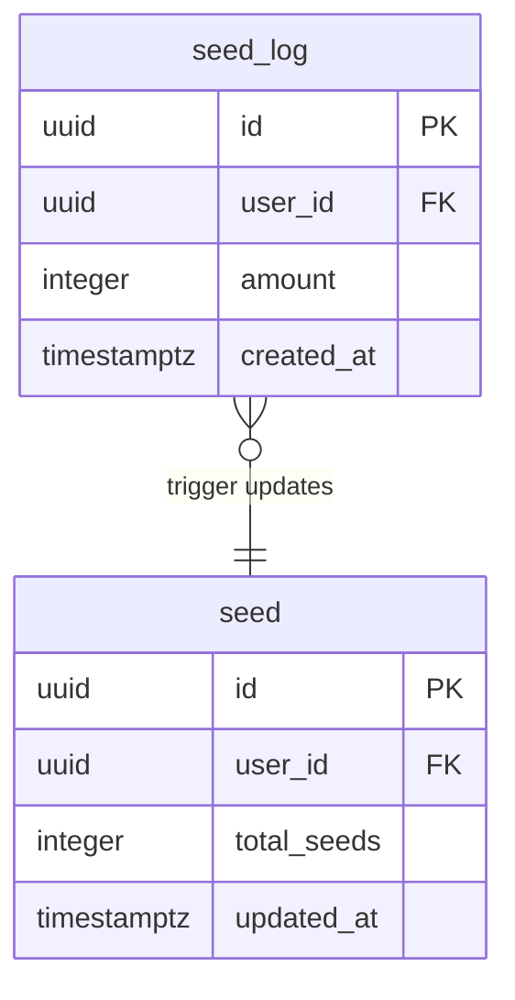
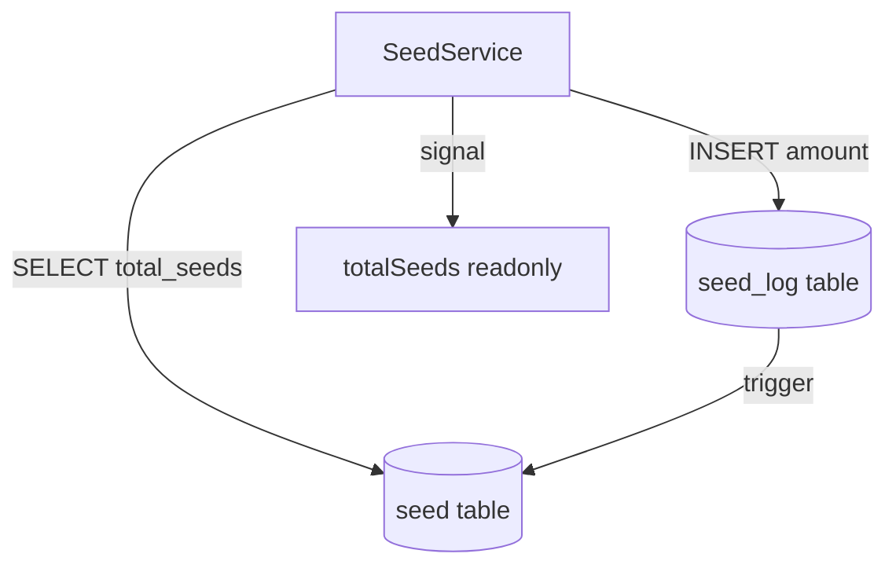
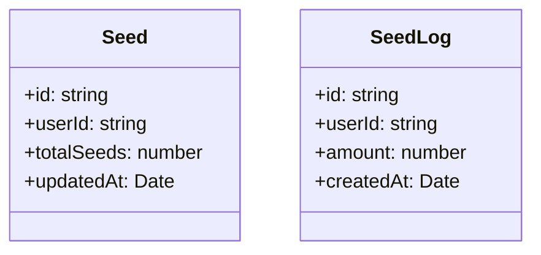
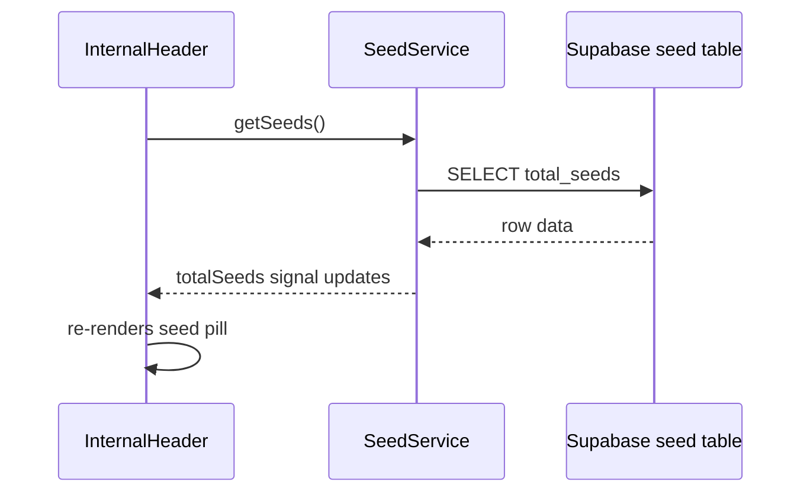
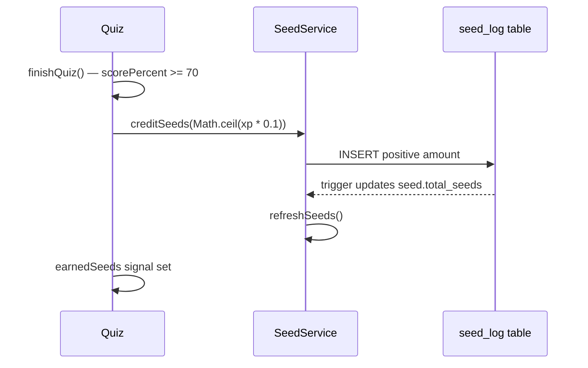
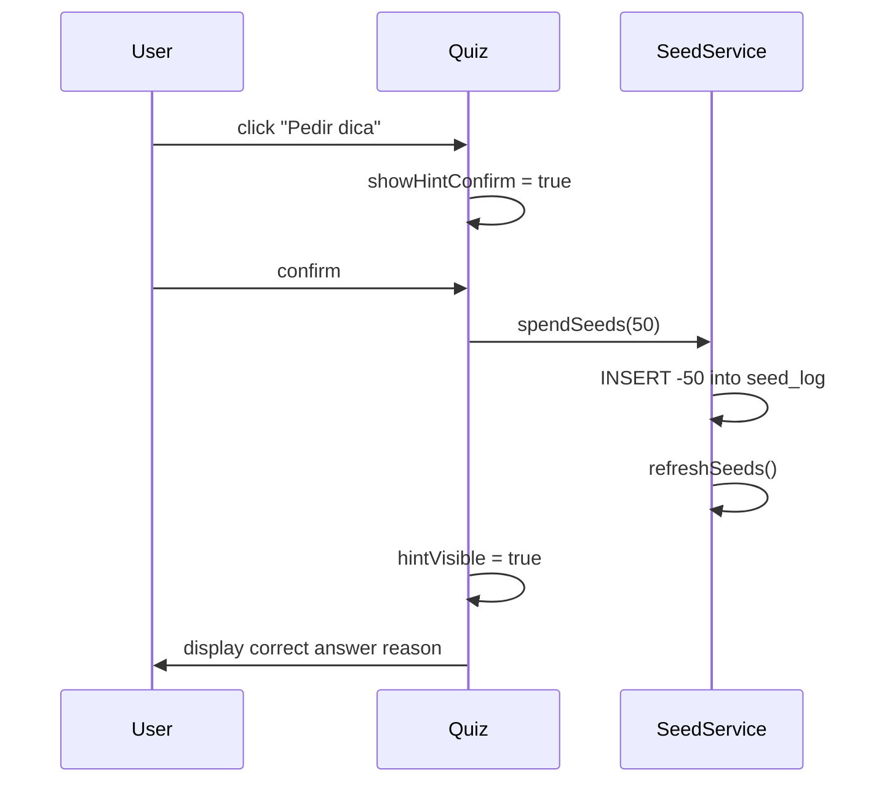
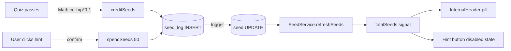
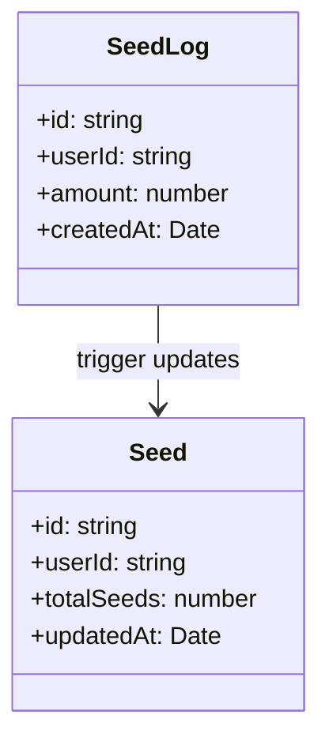

# Design Document

## Overview

The seed currency feature is introduced as a parallel system to the existing XP system. It follows the same layered architecture already established: a Supabase migration for persistence, TypeScript model classes in `src/models/`, a singleton Angular service in `src/app/services/`, and reactive signals consumed by UI components.

Persistence is handled by two new tables — `seed` (running balance) and `seed_log` (immutable ledger) — mirroring the `xp` / `xp_log` pattern. A Postgres trigger on `seed_log` keeps `seed.total_seeds` automatically up-to-date, meaning no application-level balance calculation is needed on read.

The frontend introduces a new `SeedService` that exposes a reactive `totalSeeds` signal, loaded once on header initialisation and refreshed after each credit or debit. The quiz page is extended to support purchasing a hint (spending 50 seeds per question), and the completion screen displays the seeds earned in that session.

### Change Type

new-feature

### Design Goals

1. Mirror existing XP persistence patterns so the codebase stays consistent and predictable.
2. Keep the seed balance reactive via Angular signals, ensuring the header counter updates immediately after any transaction without a page reload.
3. Encapsulate all Supabase interactions inside `SeedService`; components and quiz page must never access Supabase directly.
4. Gate hint revelation behind an explicit user confirmation to prevent accidental seed spend.

### References

- **REQ-1**: Seed Balance Persistence
- **REQ-2**: Seed Earning on Quiz Completion
- **REQ-3**: Seed Balance Display in Header
- **REQ-4**: Hint Purchase in Quiz

---

## System Architecture

### DES-1: Database Schema and Trigger

Two new tables are added via a single Supabase migration. `seed` stores one row per user with `id`, `user_id`, `total_seeds` (default 0), and `updated_at`. `seed_log` stores one row per transaction with `id`, `user_id`, `amount` (positive = credit, negative = debit), and `created_at`. Row-level security mirrors the XP tables: users may only read their own rows.

A Postgres `AFTER INSERT` trigger on `seed_log` upserts the `seed` table, adding the new `amount` to the existing `total_seeds` and refreshing `updated_at`. This guarantees balance consistency without any application-level summation.

_Implements: REQ-1.1, REQ-1.2, REQ-1.3, REQ-1.4_

---

### DES-2: SeedService

`SeedService` is a root-scoped Angular singleton that mirrors `XpService`. It exposes a readonly `totalSeeds` signal backed by a private writable signal. It provides three public methods:

- `getSeeds()` — fetches `total_seeds` from the `seed` table for the current user and updates the signal.
- `refreshSeeds()` — thin wrapper over `getSeeds()` called after any transaction.
- `spendSeeds(amount: number)` — inserts a negative-amount row into `seed_log`, then calls `refreshSeeds()`. The trigger handles the balance update server-side.
- `creditSeeds(amount: number)` — inserts a positive-amount row into `seed_log`, then calls `refreshSeeds()`.

_Implements: REQ-1.3, REQ-3.3_

---

### DES-3: TypeScript Models

Two model classes are added alongside the existing XP models to provide typed data wrappers:

- `Seed` — maps `id`, `user_id → userId`, `total_seeds → totalSeeds`, `updated_at → updatedAt`.
- `SeedLog` — maps `id`, `user_id → userId`, `amount`, `created_at → createdAt`.

_Implements: REQ-1.1, REQ-1.2_

---

### DES-4: Seed Balance in InternalHeader

`InternalHeaderComponent` already loads the XP balance via `XpService` on `ngOnInit`. The same component injects `SeedService` and calls `getSeeds()` during initialisation. The template adds a seed pill — an `` tag rendering `assets/seed/seed.png` plus the `totalSeeds()` signal value — placed immediately adjacent to the existing XP pill.

_Implements: REQ-3.1, REQ-3.2, REQ-3.3_

---

### DES-5: Seed Earning on Quiz Completion

When `finishQuiz()` runs and the quiz is marked as passed (`scorePercent >= 70`), the Quiz page calls `SeedService.creditSeeds(Math.ceil(lesson.xp * 0.1))` immediately after the existing `xpService.refreshXp()` call. The seed amount is stored in a local signal `earnedSeeds` so the completion screen can display it. No seeds are credited on a failing attempt.

_Implements: REQ-2.1, REQ-2.2, REQ-2.3_

---

### DES-6: Hint Purchase Flow in Quiz

A "Pedir dica (50 seeds)" button is rendered in the question footer, next to the "Confirmar resposta" button. The button is disabled while `totalSeeds() < 50` or while the question is already confirmed. Clicking the enabled button sets a local `showHintConfirm` signal to `true`, which renders an inline confirmation prompt. On confirmation, `SeedService.spendSeeds(50)` is called and `hintVisible` is set to `true`, revealing the `reason` of the correct answer. Cancelling the prompt resets `showHintConfirm` to `false` without any debit.

_Implements: REQ-4.1, REQ-4.2, REQ-4.3, REQ-4.4, REQ-4.5, REQ-4.6_

---

## Data Flow

## Data Models

## Error Handling

| Error Condition | Response | Recovery |
|-----------------|----------|----------|
| `seed_log` INSERT fails | `SeedService` catches error and logs it; signal is not updated | User balance remains unchanged; hint is not revealed |
| `seed` table row missing for user | `getSeeds()` returns 0 and sets signal to 0 | Consistent with XP service behaviour (`PGRST116` code ignored) |
| User has insufficient seeds | Hint button remains disabled | No action; balance is not modified |

## Impact Analysis

| Affected Area | Impact Level | Notes |
|---------------|--------------|-------|
| `InternalHeader` component | Medium | New signal injection and template pill added |
| `Quiz` page | Medium | `finishQuiz` extended; hint button and confirmation prompt added |
| `XpService` | None | Not modified |
| Supabase migrations | Additive | New migration file; no existing tables changed |

### Testing Requirements

| Test Type | Coverage Goal | Notes |
|-----------|---------------|-------|
| Unit | `SeedService` methods | Verify `totalSeeds` signal updates correctly after `getSeeds`, `creditSeeds`, and `spendSeeds` |
| Unit | Quiz component signals | Verify `earnedSeeds` is set correctly on pass, not on fail |
| Integration | Trigger behaviour | Verify `total_seeds` in `seed` table matches sum of `seed_log` entries after inserts |

### Risk Assessment

| Risk | Likelihood | Impact | Mitigation |
|------|------------|--------|------------|
| Trigger not firing on first insert (no seed row yet) | Low | High | Use `INSERT … ON CONFLICT DO UPDATE` (upsert) in trigger to create the row if absent |
| Race condition: double hint purchase | Low | Medium | Disable button immediately on first click; re-enable only if spend fails |

### Rollback Plan

| Scenario | Rollback Steps | Time to Recovery |
|----------|----------------|------------------|
| Migration breaks existing data | Revert migration via Supabase dashboard; re-deploy previous frontend build | < 15 minutes |

## Code Anatomy

| File Path | Purpose | Implements |
|-----------|---------|------------|
| `supabase/migrations/<timestamp>_create_seed_tables.sql` | Creates `seed`, `seed_log` tables, trigger, and RLS policies | DES-1 |
| `src/models/seed/seed.ts` | TypeScript model for `seed` table row | DES-3 |
| `src/models/seed-log/seed-log.ts` | TypeScript model for `seed_log` table row | DES-3 |
| `src/app/services/seed.ts` | Root singleton service: `getSeeds`, `creditSeeds`, `spendSeeds`, `totalSeeds` signal | DES-2 |
| `src/app/components/internal-header/internal-header.ts` | Injects `SeedService`; calls `getSeeds()` on init | DES-4 |
| `src/app/components/internal-header/internal-header.html` | Adds seed pill adjacent to XP pill | DES-4 |
| `src/app/pages/app/quiz/quiz.ts` | Calls `creditSeeds` on pass; exposes `earnedSeeds`, `hintVisible`, `showHintConfirm` signals | DES-5, DES-6 |
| `src/app/pages/app/quiz/quiz.html` | Renders seeds earned on completion; adds hint button and inline confirmation | DES-5, DES-6 |

## Traceability Matrix

| Design Element | Requirements |
|----------------|--------------|
| DES-1 | REQ-1.1, REQ-1.2, REQ-1.3, REQ-1.4 |
| DES-2 | REQ-1.3, REQ-3.3 |
| DES-3 | REQ-1.1, REQ-1.2 |
| DES-4 | REQ-3.1, REQ-3.2, REQ-3.3 |
| DES-5 | REQ-2.1, REQ-2.2, REQ-2.3 |
| DES-6 | REQ-4.1, REQ-4.2, REQ-4.3, REQ-4.4, REQ-4.5, REQ-4.6 |
