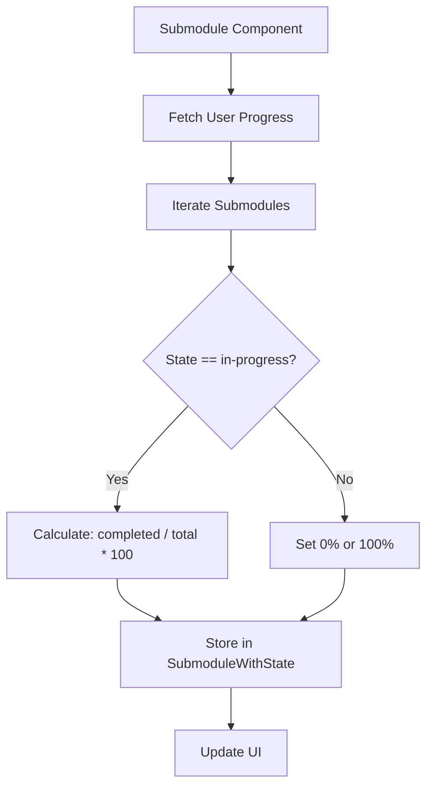

# Design Document

## Overview

We need to dynamically calculate and display the progress percentage for submodules that have the state 'in-progress'. The calculation will be based on the number of completed lessons out of the total number of lessons for that submodule.

### Change Type

enhancement

### Design Goals

1. Enhance the `SubmoduleWithState` interface to hold the `progressPercentage` value.
2. Update the `Submodule` component logic to dynamically calculate the progress percentage for 'in-progress' submodules.
3. Update the `Submodule` template to bind to the dynamically calculated percentage instead of hardcoded values.

### References

- **REQ-1**: Calculate Dynamic Submodule Progress

## System Architecture

### DES-1: Dynamic Progress Calculation

The `Submodule` component retrieves the list of lessons for each submodule. During the iteration over submodules to determine their state, when a submodule is found to be 'in-progress', the component will count how many of its lessons are in the `completedLessonIds` set. The progress is then calculated as `(completedCount / totalLessonsCount) * 100` and stored in `SubmoduleWithState.progressPercentage`. The template will use this property, ensuring 'completed' explicitly sets 100 and 'not-started' sets 0.

_Implements: REQ-1.1, REQ-1.2, REQ-1.3_

## Code Anatomy

| File Path | Purpose | Implements |
|-----------|---------|------------|
| src/app/pages/app/submodule/submodule.ts | Enhance SubmoduleWithState interface and calculate percentage | DES-1 |
| src/app/pages/app/submodule/submodule.html | Bind the percent property to the calculated value | DES-1 |

## Traceability Matrix

| Design Element | Requirements |
|----------------|--------------|
| DES-1 | REQ-1.1, REQ-1.2, REQ-1.3 |
