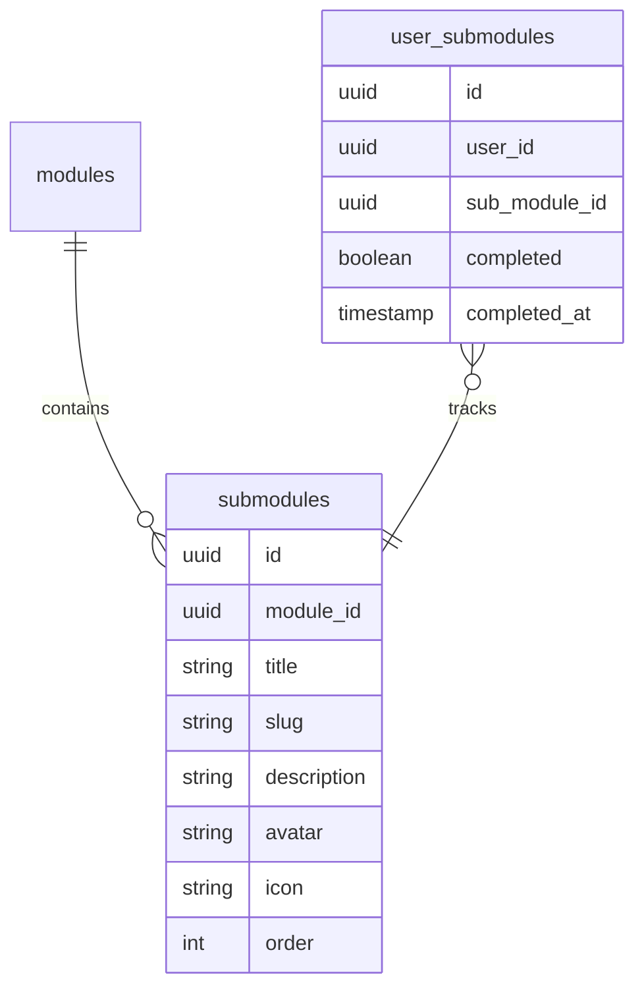
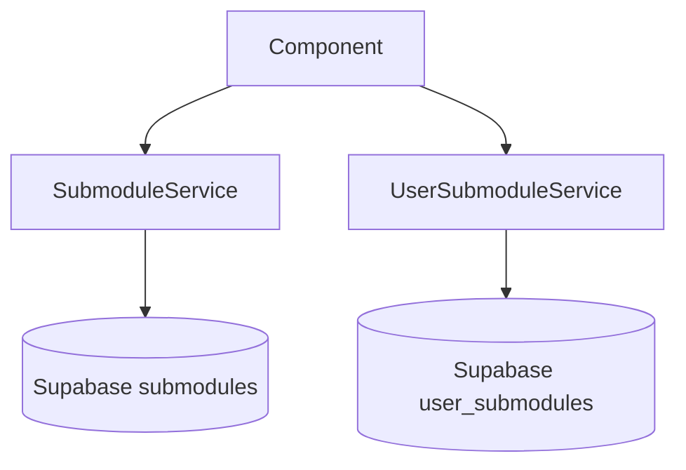
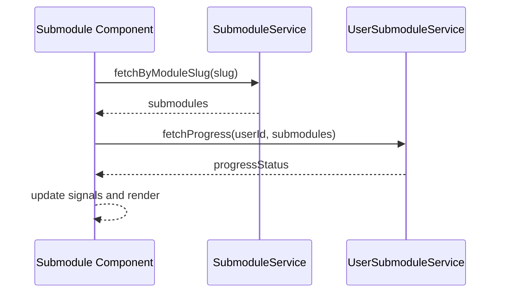
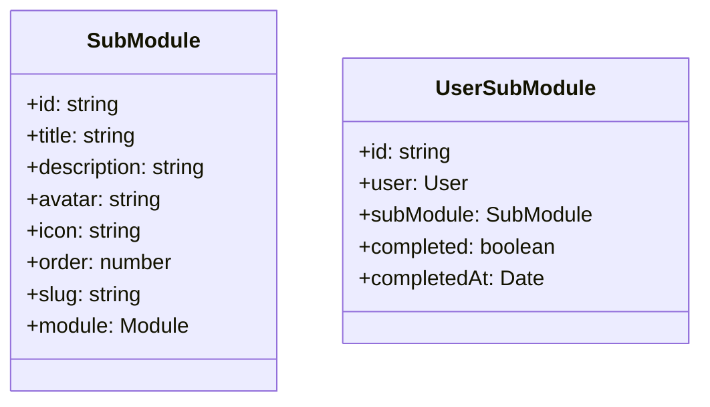

# Design Document

## Overview

The integration of Submodules introduces an additional layer of granularity into the existing modules system. The database layer will be expanded with `submodules` and `user_submodules` tables in Supabase to track structural data and individual progression respectively. On the frontend, new services will facilitate interaction with these tables, and the UI will reflect learning progress by differentiating between not started, in-progress, and completed states.

### Change Type

new-feature

### Design Goals

1. Seamlessly integrate the submodules hierarchy under the current modules system.
2. Establish a clear, typed Service layer to interface with the new Supabase tables.
3. Provide visual cues for user progress corresponding to each submodule based on existing patterns.

### References

- **REQ-1**: Submodules Storage
- **REQ-2**: User Progress Tracking
- **REQ-3**: Retrieve Submodules
- **REQ-4**: Display Submodules

## System Architecture

### DES-1: Submodules Database Schema

The database expands the learning track schema. A new `submodules` table links directly to `modules` via a foreign key, storing visual and structural data. The `user_submodules` table handles the many-to-many relationship tracking user progress for each submodule, establishing status flags and completion timestamps.

_Implements: REQ-1.1, REQ-2.1_

### DES-2: Frontend Service Layer

Two new Angular services, `SubmoduleService` and `UserSubmoduleService`, will encapsulate Supabase queries. Components will inject these services to retrieve data without exposing raw database calls. 

_Implements: REQ-3.1, REQ-3.2_

### DES-3: Submodule UI Component Integration

The submodules page component binds to angular signals holding state derived from the service layer. It filters submodules by matching the active module slug and computes a `progressState` (not-started, in-progress, completed) to drive visual indicators mimicking the current UI.

_Implements: REQ-4.1, REQ-4.2_

## Code Anatomy

| File Path | Purpose | Implements |
|-----------|---------|------------|
| supabase/migrations/20240413000000_create_submodules.sql | DDL for the new tables and RLS | DES-1 |
| src/app/services/submodule/submodule.service.ts | Encapsulates submodules table access | DES-2 |
| src/app/services/user-submodule/user-submodule.service.ts | Encapsulates user progress access | DES-2 |
| src/app/pages/app/submodule/submodule.component.ts | UI logic and progress computation | DES-3 |
| src/app/pages/app/submodule/submodule.html | UI rendering with progress visual states | DES-3 |

## Data Models

## Traceability Matrix

| Design Element | Requirements |
|----------------|--------------|
| DES-1 | REQ-1.1, REQ-2.1 |
| DES-2 | REQ-3.1, REQ-3.2 |
| DES-3 | REQ-4.1, REQ-4.2 |
