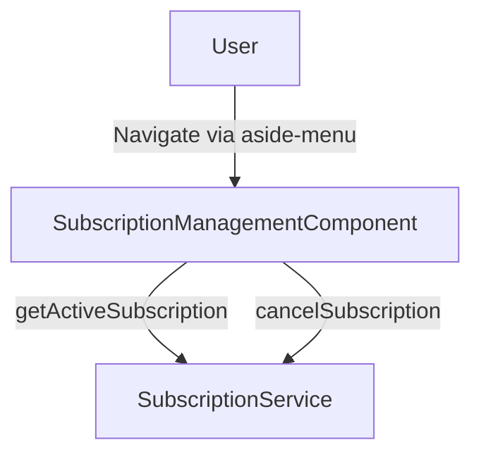
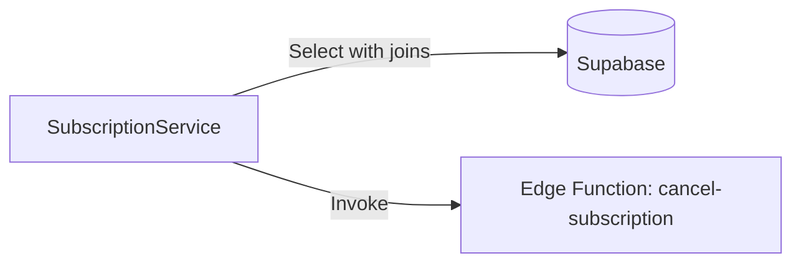
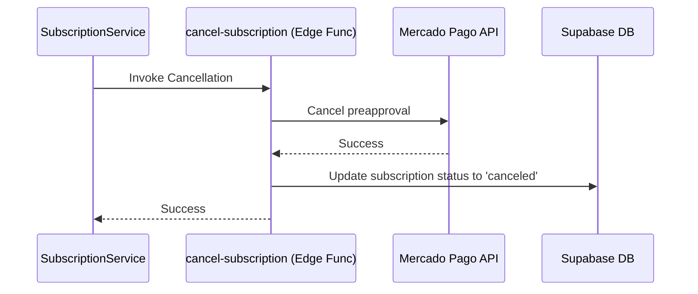
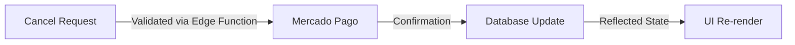

# Design Document

## Overview

This feature introduces a subscription management screen that allows users to view their current active subscription, the plan they are enrolled in, and any applied coupons along with their remaining discounted installments. It also provides the ability to cancel an active subscription, integrating directly with Mercado Pago to halt future billings and updating the local database state.

### Change Type

new-feature

### Design Goals

1. Provide clear visibility into the user's current subscription state and active coupon benefits.
2. Enable users to manage and cancel their subscriptions without leaving the application.
3. Ensure subscription cancellations are reliably synchronized with the external payment gateway (Mercado Pago).

### References

- **REQ-1**: Navigation to Subscription Management
- **REQ-2**: Free Account State
- **REQ-3**: View Active Subscription Details
- **REQ-4**: Cancel Subscription

## System Architecture

### DES-1: Subscription Management UI

The `SubscriptionManagementComponent` serves as the primary presentation layer for this feature. It uses Angular's standalone component structure and reactive signals to display the subscription state. It fetches data from the `SubscriptionService` on initialization and presents either a "Free Account" message or the full subscription details (including coupon logic).

_Implements: REQ-1.1, REQ-2.1, REQ-3.1, REQ-3.2, REQ-3.3, REQ-4.1_

### DES-2: Subscription Service Access Layer

The `SubscriptionService` is extended to support data retrieval and mutation operations. It queries the `subscriptions` table, joining the related `plans` and `coupons` records to provide a full view of the active subscription. It also acts as the client for the new cancellation Edge Function.

_Implements: REQ-3.1, REQ-3.2, REQ-3.3, REQ-4.1, REQ-4.2_

### DES-3: Cancel Subscription Edge Function

A new Supabase Edge Function (`cancel-subscription`) that orchestrates the cancellation process. It receives the cancellation request, calls the Mercado Pago API to cancel the underlying preapproval or recurring profile, and updates the local database status to ensure state consistency.

_Implements: REQ-4.1, REQ-4.2_

## Data Flow

## Code Anatomy

| File Path | Purpose | Implements |
|-----------|---------|------------|
| src/app/pages/app/subscription-management/subscription-management.component.ts | Subscription view and cancel interactions | DES-1 |
| src/app/pages/app/subscription-management/subscription-management.html | HTML template for the UI | DES-1 |
| src/app/services/subscription.ts | Service methods for fetching and canceling subscriptions | DES-2 |
| supabase/functions/cancel-subscription/index.ts | Edge function orchestrating MP and DB cancellation | DES-3 |

## Traceability Matrix

| Design Element | Requirements |
|----------------|--------------|
| DES-1 | REQ-1.1, REQ-2.1, REQ-3.1, REQ-3.2, REQ-3.3, REQ-4.1 |
| DES-2 | REQ-3.1, REQ-3.2, REQ-3.3, REQ-4.1, REQ-4.2 |
| DES-3 | REQ-4.1, REQ-4.2 |
