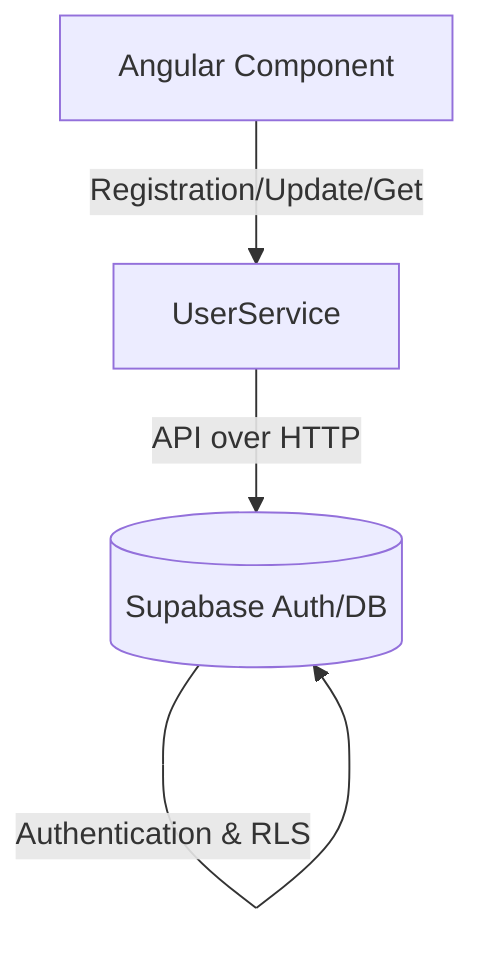
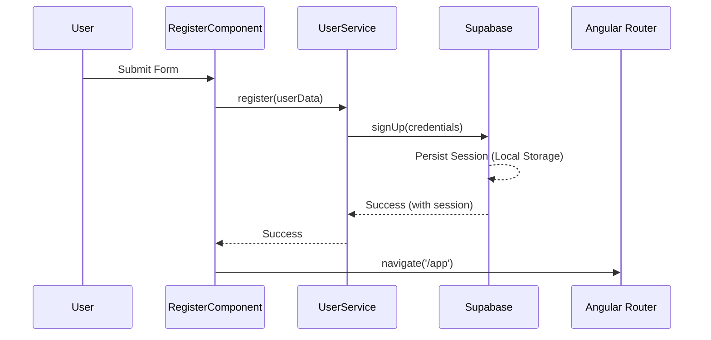

# Design Document

## Overview

This document outlines the technical design for the Supabase User Integration. We will introduce a dedicated service (`UserService`) to handle communication with the Supabase API to fulfill user registration, fetching profile data, and updating profile data. The UI component (`RegisterComponent`) will be updated to consume this service and handle routing (e.g., redirecting to the app dashboard on successful registration). Supabase Authentication automatically handles session persistence in local storage when initialized, which satisfies the immediate login requirement.

### Change Type

enhancement

### Design Goals

1. Isolate all Supabase integration logic inside a dedicated Angular service for the User domain.
2. Abstract the API data so the application interacts via the internal `User` model.
3. Handle component redirection logic to the application dashboard (`/app`) post-registration.
4. Ensure the authentication session is established upon successful registration.

### References

- **REQ-1**: User Registration
- **REQ-2**: Read User Profile
- **REQ-3**: Update User Profile

## System Architecture

### DES-1: User Service layer

The `UserService` acts as the interface between the Angular application and Supabase. It uses the Supabase client to execute `auth.signUp` for registration, `auth.getUser` for reading the current authenticated user profile, and `auth.updateUser` or `from('users').update` for updating user metadata/profile data. It encapsulates error handling and maps the Supabase responses to the application's `User` model. Security constraints like denying access to unauthenticated users or users attempting to access foreign profiles are naturally enforced by Supabase session tokens and RLS logic.

_Implements: REQ-1.1, REQ-1.2, REQ-2.1, REQ-2.2, REQ-2.3, REQ-3.1, REQ-3.2_

### DES-2: Register Component Integration

The `RegisterComponent` is responsible for collecting user input, calling the `UserService` to perform the registration, and listening for the result. Upon a successful registration, the Supabase client automatically persists the session. The component then uses the Angular `Router` to navigate the user to the application dashboard (`/app`).

_Implements: REQ-1.1, REQ-1.2, REQ-1.3_

## Code Anatomy

| File Path | Purpose | Implements |
|-----------|---------|------------|
| src/app/services/user/user.service.ts | Core orchestration for Supabase user operations | DES-1 |
| src/app/pages/register/register.ts | Form handling and redirect logic | DES-2 |

## Error Handling

| Error Condition | Response | Recovery |
|-----------------|----------|----------|
| Invalid Registration Email | Return Supabase error via Service | Display error message in UI |
| Unauthenticated Read/Update | Reject Promise with auth error | Component handles error, optional redirect to login |

## Traceability Matrix

| Design Element | Requirements |
|----------------|--------------|
| DES-1 | REQ-1.1, REQ-1.2, REQ-2.1, REQ-2.2, REQ-2.3, REQ-3.1, REQ-3.2 |
| DES-2 | REQ-1.1, REQ-1.2, REQ-1.3 |
