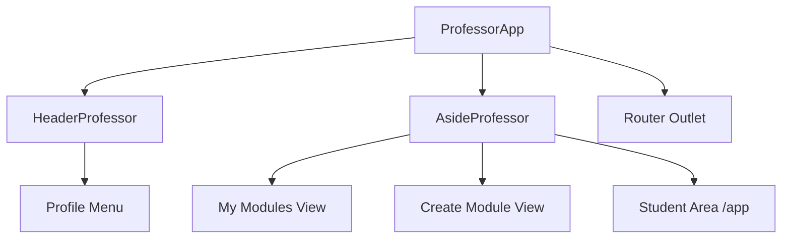
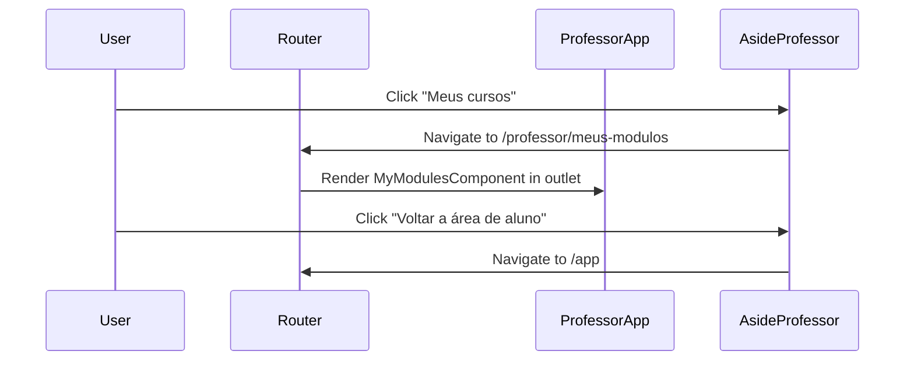

# Design Document

## Overview
This design covers the structural and navigational elements of the Teacher Area. It involves creating custom header and aside components that mimic the main app's look and feel but are tailored for teacher functionality. The layout will be managed by `ProfessorApp`, which will serve as a shell for teacher-specific routes, ensuring a consistent user experience while isolating educator tools.

### Change Type
`new-feature`

### Design Goals
1. Implement `HeaderProfessor` and `AsideProfessor` as specialized versions of existing navigation components.
2. Structure the `ProfessorApp` layout with separate HTML and CSS to maintain consistency with the student app.
3. Configure child routing for module management features.

### References
- **REQ-1**: Teacher Header Navigation
- **REQ-2**: Teacher Aside Navigation
- **REQ-3**: Module Management Routing
- **REQ-4**: Layout Structure Integration

## System Architecture

### DES-1: Specialized Navigation Components
The Teacher Area requires specific navigation elements that differ from the student area. We will create `HeaderProfessorComponent` and `AsideProfessorComponent` within `src/app/pages/professor/components`. These components will inherit the visual style of `InternalHeader` and `AsideMenu` but will be functionally distinct.

_Implements: REQ-1.1, REQ-1.2, REQ-2.1, REQ-2.2, REQ-2.3, REQ-2.5, REQ-2.6_

### DES-2: Layout Shell and Routing
The `ProfessorAppComponent` will be refactored to use external template and style files, following the `App` component pattern. It will host the `HeaderProfessor`, `AsideProfessor`, and a `router-outlet` for child views. Routing will be updated in `app.routes.ts` to include friendly Portuguese paths for teacher features.

_Implements: REQ-2.4, REQ-3.1, REQ-3.2, REQ-4.1, REQ-4.2_

## Code Anatomy

| File Path | Purpose | Implements |
|-----------|---------|------------|
| `src/app/pages/professor/components/header-professor/` | Custom header for the teacher area, excluding XP/seeds. | DES-1 |
| `src/app/pages/professor/components/aside-professor/` | Custom side menu with teacher-specific links. | DES-1 |
| `src/app/pages/professor/professor-app/professor-app.ts` | Main layout shell for the teacher area. | DES-2 |
| `src/app/pages/professor/professor-app/professor-app.html` | Layout template with header and aside. | DES-2 |
| `src/app/pages/professor/professor-app/professor-app.scss` | Layout styling following Neon Terminal aesthetic. | DES-2 |
| `src/app/pages/professor/professor-app/my-modules/` | View for managing existing modules. | DES-2 |
| `src/app/pages/professor/professor-app/create-module/` | View for creating new modules. | DES-2 |
| `src/app/app.routes.ts` | Configuration of teacher area child routes. | DES-2 |

## Impact Analysis

| Affected Area | Impact Level | Notes |
|---------------|--------------|-------|
| `src/app/app.routes.ts` | Medium | Adding child routes for the teacher area. |
| `src/app/pages/professor/` | High | Restructuring existing teacher folder. |

## Traceability Matrix

| Design Element | Requirements |
|----------------|--------------|
| DES-1 | REQ-1.1, REQ-1.2, REQ-2.1, REQ-2.2, REQ-2.3, REQ-2.5, REQ-2.6 |
| DES-2 | REQ-2.4, REQ-3.1, REQ-3.2, REQ-4.1, REQ-4.2 |
