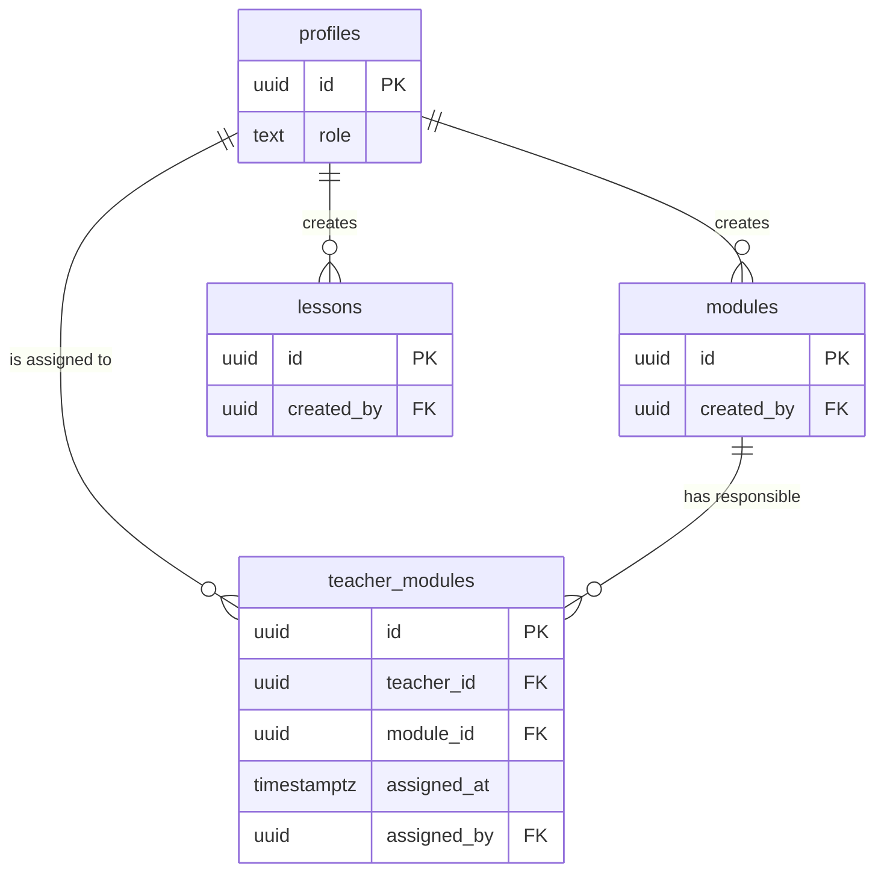
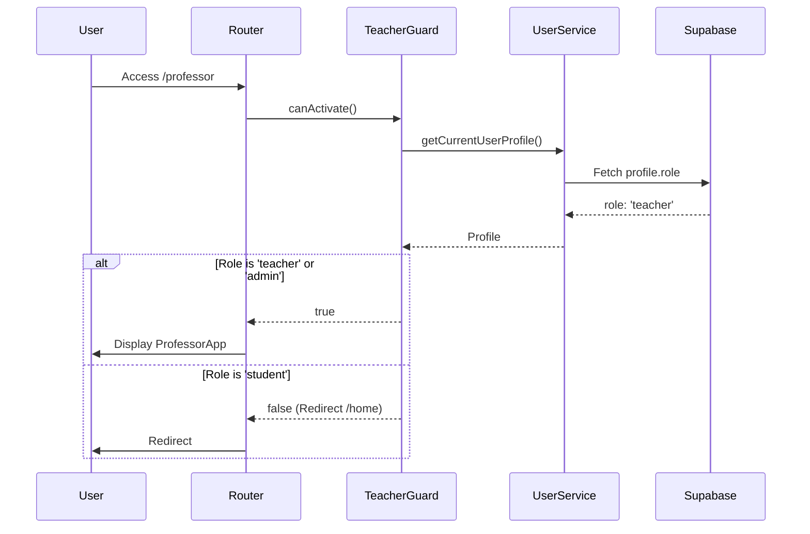
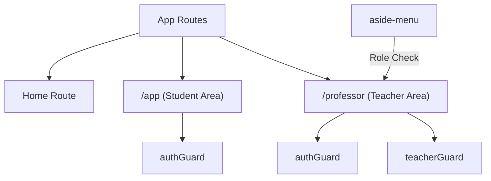
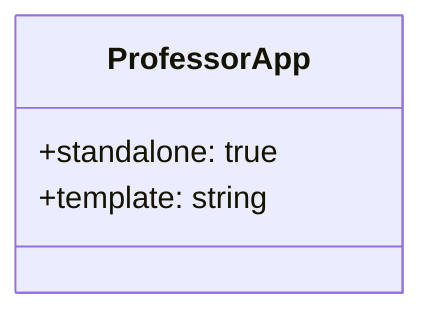
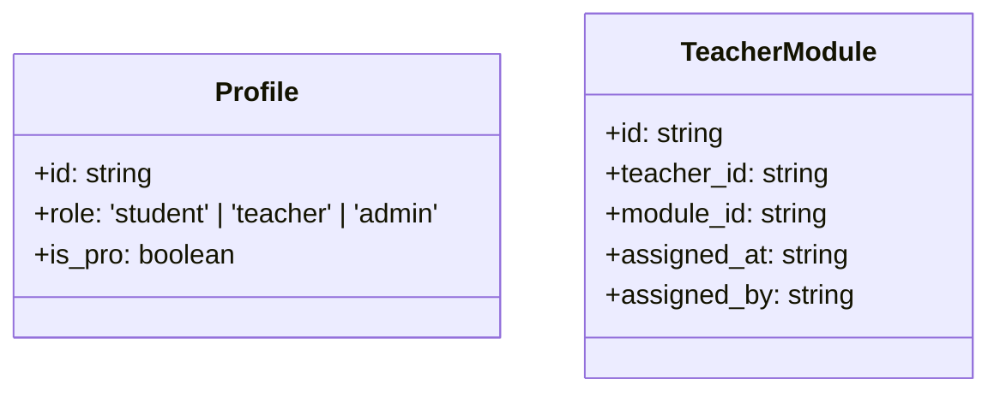

# Design Document

## Overview
This design document outlines the technical approach for implementing the Teacher Area foundation. The architecture focuses on extending the existing user profile system to support roles, establishing content ownership, and protecting administrative routes using Angular guards. The solution leverages Supabase for data persistence and role-based security via RLS policies. The Teacher Area is designed as a top-level route, independent of the student area, allowing for separate layouts in future phases.

### Change Type
new-feature

### Design Goals
1. Establish a multi-role authorization system (student, teacher, admin).
2. Create a mechanism to associate teachers with specific modules.
3. Protect administrative routes and UI elements from unauthorized access.
4. Configure the Teacher Area as a sibling to the main student application route.

### References
- **REQ-1**: Database Schema for Roles and Assignments
- **REQ-2**: Teacher Access Control
- **REQ-3**: Navigation and Routing
- **REQ-4**: Foundation Components

## System Architecture

### DES-1: Enhanced Database Schema
The database schema is extended to support hierarchical roles and content ownership. The `profiles` table is modified to include a `role` column, and a new `teacher_modules` junction table is created to manage responsibility assignments.

_Implements: REQ-1.1, REQ-1.2, REQ-1.3, REQ-1.4, REQ-1.5, REQ-1.6_

### DES-2: Role-Based Access Control (RBAC) Logic
Access control is implemented at both the application level (Angular Guards) and the database level (Supabase RLS). The `teacherGuard` ensures that only users with the correct role can activate teacher routes.

_Implements: REQ-2.1, REQ-2.2, REQ-2.3_

### DES-3: Sibling Routing Configuration
The application routing is updated to include the teacher area as a top-level route, sibling to the `/app` route. This structural decision ensures that the Teacher Area can eventually support its own unique layout (Header/Aside) independent of the student area.

_Implements: REQ-3.1, REQ-3.2, REQ-3.3, REQ-3.4_

### DES-4: Teacher Area Base Component
A new standalone component `ProfessorApp` is created as the entry point for the teacher area. It provides a clean slate for future administrative UI implementation.

_Implements: REQ-4.1, REQ-4.2_

## Code Anatomy

| File Path | Purpose | Implements |
|-----------|---------|------------|
| supabase/migrations/[timestamp]_teacher_area_setup.sql | Database schema changes and RLS policies | DES-1 |
| src/models/profile/profile.ts | Update interface to include the `role` field | DES-1 |
| src/app/components/guards/teacher.guard.ts | Route protection logic for teacher features | DES-2 |
| src/app/app.routes.ts | Configuration of the `'professor'` route | DES-3 |
| src/app/components/aside-menu/aside-menu.html | UI integration for the teacher link | DES-3 |
| src/app/pages/professor/professor-app/professor-app.ts | Base component for the teacher area | DES-4 |

## Data Models

## Traceability Matrix

| Design Element | Requirements |
|----------------|--------------|
| DES-1 | REQ-1.1, REQ-1.2, REQ-1.3, REQ-1.4, REQ-1.5, REQ-1.6 |
| DES-2 | REQ-2.1, REQ-2.2, REQ-2.3 |
| DES-3 | REQ-3.1, REQ-3.2, REQ-3.3, REQ-3.4 |
| DES-4 | REQ-4.1, REQ-4.2 |
