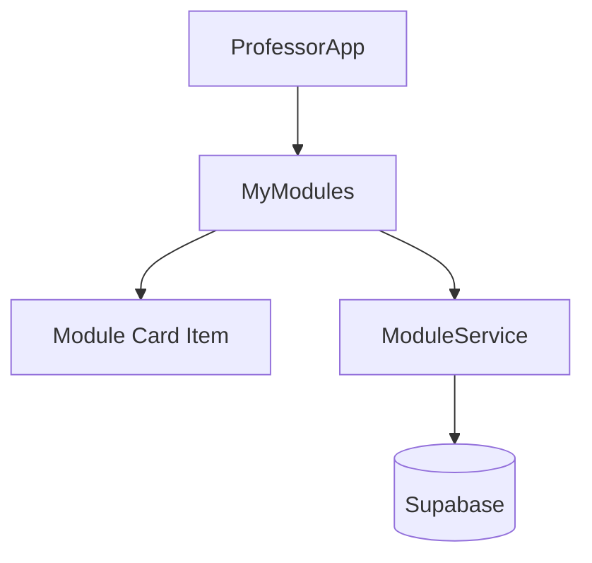
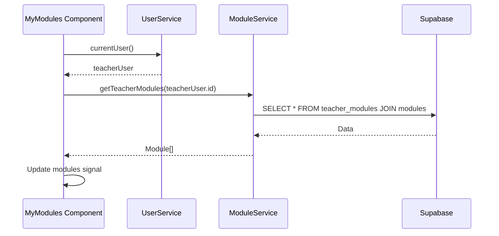

# Technical Design - Teacher Modules List

This document outlines the technical implementation for displaying the modules assigned to a teacher.

## User Review Required

> [!IMPORTANT]
> The "Edit" button will redirect to `/professor/edit-module/:slug`. Note that the edit module component and page are not being created in this task, only the navigation to them.

## Proposed Changes

### DES-1: Data Layer Updates
#### [MODIFY] [module.ts](file:///home/developer/workspace-pessoal/semeandodevsapp/src/app/services/module.ts)
- Add `getTeacherModules(teacherId: string): Promise<Module[]>` method.
- Implementation: Query `teacher_modules` table joining with `modules` table using Supabase client.

### DES-2: Component Logic
#### [MODIFY] [my-modules.ts](file:///home/developer/workspace-pessoal/semeandodevsapp/src/app/pages/professor/professor-app/my-modules/my-modules.ts)
- Inject `ModuleService` and `UserService`.
- Implement `modules`, `isLoading`, and `error` as Angular Signals.
- Load data in an `effect` or `onInit` using the current teacher's ID from `UserService`.

### DES-3: Template & Grid
#### [MODIFY] [my-modules.html](file:///home/developer/workspace-pessoal/semeandodevsapp/src/app/pages/professor/professor-app/my-modules/my-modules.html)
- Implement a responsive grid using Tailwind CSS: `grid grid-cols-1 md:grid-cols-2 gap-6`.
- Create a module card structure based on the existing `Modules` component but simplified.
- Add an "Editar" button positioned in the bottom right corner of each card.

### DES-4: Aesthetics & Styling
#### [MODIFY] [my-modules.scss](file:///home/developer/workspace-pessoal/semeandodevsapp/src/app/pages/professor/professor-app/my-modules/my-modules.scss)
- Apply "Neon Terminal" design tokens.
- Ensure background-based boundaries and no 1px borders.

### DES-5: Accessibility & UX
#### [MODIFY] [my-modules.html](file:///home/developer/workspace-pessoal/semeandodevsapp/src/app/pages/professor/professor-app/my-modules/my-modules.html)
- Add descriptive ARIA labels to interactive elements.
- Ensure proper heading hierarchy and color contrast.

## Architecture Diagrams

### Component Hierarchy

### Data Flow

## Traceability

- **DES-1**: Implements **REQ-1** and **REQ-8**.
- **DES-2**: Implements **REQ-9** and **REQ-10**.
- **DES-3**: Implements **REQ-2**, **REQ-3**, **REQ-4**, and **REQ-11**.
- **DES-4**: Implements **REQ-6** and **REQ-12**.
- **DES-5**: Implements **REQ-5**, **REQ-7**, and **REQ-13**. (Implicitly handled in overall design)

## Verification Plan

### Automated Tests
- Component unit tests to verify:
    - Loading state is shown initially.
    - Modules are displayed after fetching.
    - Error state is shown on failure.
    - "Editar" button has correct routerLink.

### Manual Verification
- Log in as a teacher.
- Navigate to `/professor/meus-cursos`.
- Verify the grid layout on different screen sizes (mobile vs desktop).
- Click "Editar" and verify it attempts to navigate to the correct URL.
