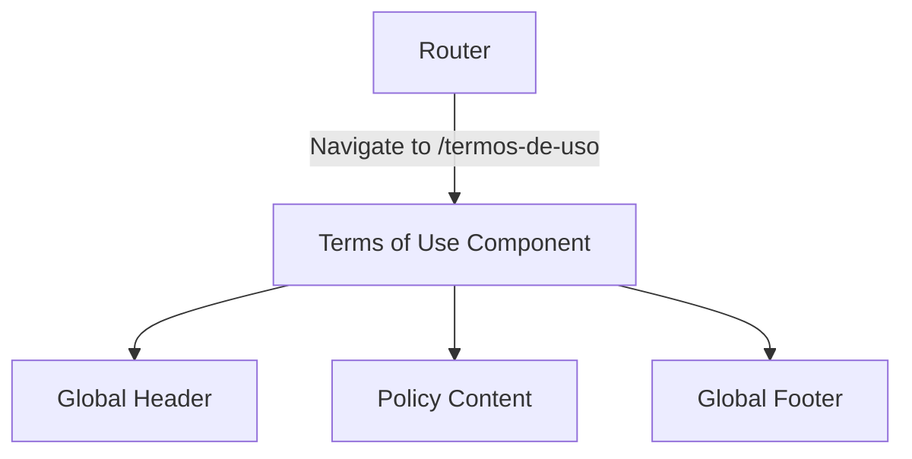
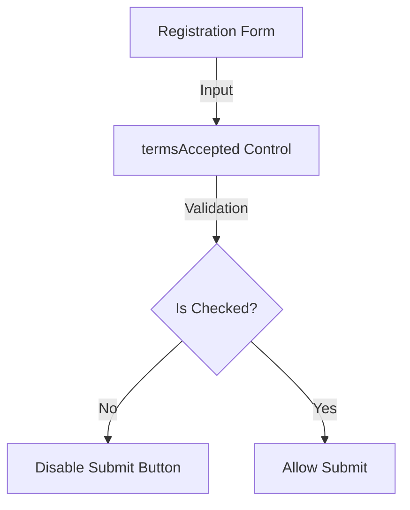

# Design Document

## Overview

This change introduces a standalone Terms of Use page and integrates a mandatory acceptance checkbox into the existing registration form. It relies on existing components such as the global header and footer, thereby keeping the layout consistent.

### Change Type

enhancement

### Design Goals

1. Provide an accessible and easily routable Terms of Use page.
2. Ensure explicit user consent during the registration process by blocking form submission until the Terms of Use checkbox is accepted.

### References

- **REQ-1**: Terms of Use Page
- **REQ-2**: Registration Checkbox

## System Architecture

### DES-1: Terms of Use Page Component

The core of the feature is a new standalone Angular component (`terms-of-use`). It acts as a static content host that structures the policy text while orchestrating the inclusion of the preexisting `<app-header>` and `<app-footer>` components. Its corresponding route configuration binds it to a public-facing URL path (`/termos-de-uso`) and applies the page title natively through the router configuration.

_Implements: REQ-1.1, REQ-1.2, REQ-1.3, REQ-1.4_

### DES-2: Registration Terms Validator Integration

This design element modifies the existing `register` page component. A new `termsAccepted` boolean form control will be introduced to the registration form group with a `Validators.requiredTrue` constraint. The template will render a checkbox wired to this control and provide a direct link to the new Terms of Use route, enforcing acceptance before allowing the submit action.

_Implements: REQ-2.1, REQ-2.2, REQ-2.3, REQ-2.4_

## Code Anatomy

| File Path | Purpose | Implements |
|-----------|---------|------------|
| src/app/pages/terms-of-use/terms-of-use.html | Renders policy content, header, and footer | DES-1 |
| src/app/pages/terms-of-use/terms-of-use.ts | Standalone component declaring imports for header and footer | DES-1 |
| src/app/app.routes.ts | Defines route and document title for the terms page | DES-1 |
| src/app/pages/register/register.html | Checkbox UI and link added to the form template | DES-2 |
| src/app/pages/register/register.ts | Form group configuration adding `termsAccepted` validator | DES-2 |

## Impact Analysis

| Affected Area | Impact Level | Notes |
|---------------|--------------|-------|
| src/app/pages/register/register.ts | Medium | Updates existing form validation logic |
| src/app/app.routes.ts | Low | Adds an additional route |

### Testing Requirements

| Test Type | Coverage Goal | Notes |
|-----------|---------------|-------|
| Unit Test | terms-of-use component | Verifies rendering of header and footer |
| Unit Test | register component | Verifies that form is invalid when checkbox is false |

## Traceability Matrix

| Design Element | Requirements |
|----------------|--------------|
| DES-1 | REQ-1.1, REQ-1.2, REQ-1.3, REQ-1.4 |
| DES-2 | REQ-2.1, REQ-2.2, REQ-2.3, REQ-2.4 |
