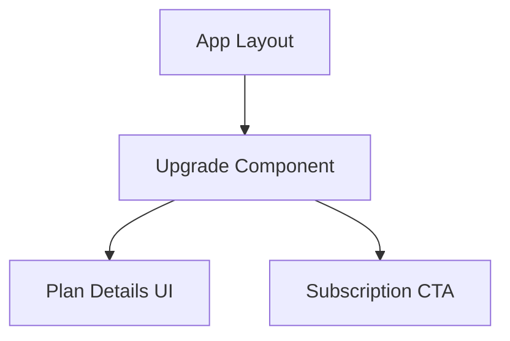
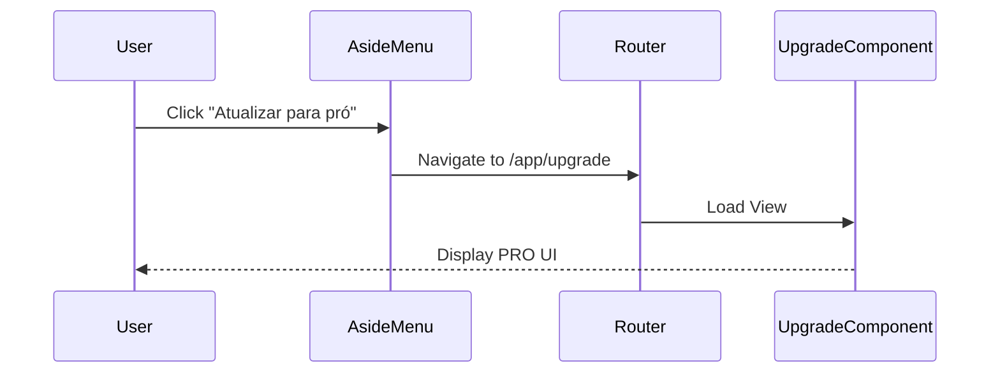

# Design Document

## Overview

The new Assinatura PRO feature introduces a dedicated upgrade view within the main application. It requires a new Angular standalone component, route configuration, and an update to the `aside-menu` component to enable navigation. This change focuses on static UI templating and local routing without any backend logic at this stage.

### Change Type

new-feature

### Design Goals

1. Implement the static PRO subscription UI following the Semeando Devs design system.
2. Ensure frictionless navigation from the existing sidebar menu to the new upgrade view.

### References

- **REQ-1**: Display Assinatura PRO Layout
- **REQ-2**: Navigation from Aside Menu

## System Architecture

### DES-1: Upgrade Page Component

The `UpgradeComponent` will be a standalone Angular component located under `src/app/pages/app/upgrade`. It is responsible for displaying the premium plan features and pricing statically, according to the Stitch design.

_Implements: REQ-1.1, REQ-1.2_

### DES-2: Routing and Navigation Integration

The `app.routes.ts` file needs a new child route for the upgrade component. The `aside-menu` component will be updated to include a `routerLink` pointing to this new route when the "Atualizar para pró" button is clicked.

_Implements: REQ-2.1_

## Code Anatomy

| File Path | Purpose | Implements |
|-----------|---------|------------|
| src/app/pages/app/upgrade/upgrade.component.ts | Component class definition | DES-1 |
| src/app/pages/app/upgrade/upgrade.html | Component template with the Stitch design | DES-1 |
| src/app/pages/app/upgrade/upgrade.scss | Component styles adhering to design tokens | DES-1 |
| src/app/app.routes.ts | Route configuration for the new page | DES-2 |
| src/app/components/aside-menu/aside-menu.html | Update the navigation bound to the button | DES-2 |

## Traceability Matrix

| Design Element | Requirements |
|----------------|--------------|
| DES-1 | REQ-1.1, REQ-1.2 |
| DES-2 | REQ-2.1 |
