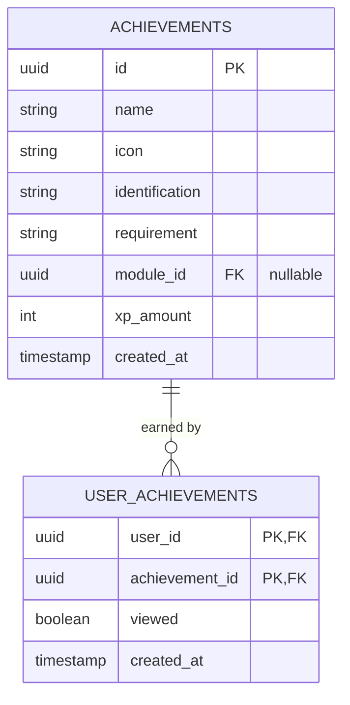
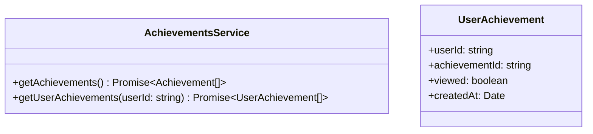
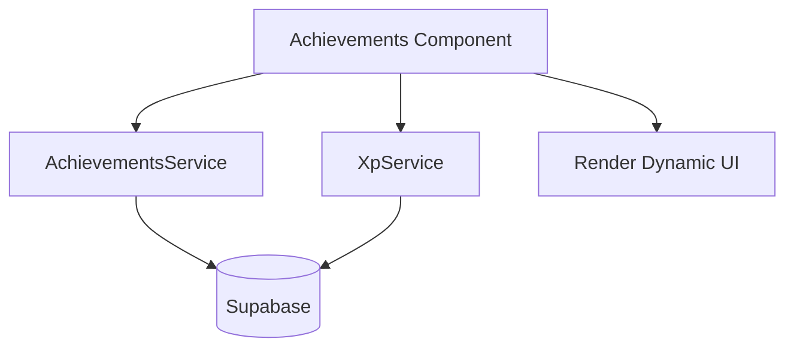

# Design Document

## Overview
This document outlines the technical design for the new Achievements (Conquistas) feature. The design introduces the necessary database schema in Supabase (`achievements` and `user_achievements` tables) along with a migration to populate the predefined achievements. On the frontend, a new TypeScript model for user achievements and an achievements service will be created. The existing `Achievements` Angular component will be refactored to fetch real data and dynamically render the gamification UI using signals.

### Change Type
new-feature

### Design Goals
1. Establish a solid data foundation for achievements and user progress tracking.
2. Ensure the achievements UI remains responsive and reflects the "Luminescent Blueprint" design system by conditionally applying color or grayscale based on user ownership.
3. Preserve the current UI structure while converting hardcoded HTML elements into dynamic loops.

### References
- **REQ-1**: Global Achievements Data Structure
- **REQ-2**: Track User Achievements
- **REQ-3**: Display Achievements Summary Header
- **REQ-4**: Display Achievements List

## System Architecture

### DES-1: Database Schema and Migrations
The database requires two new tables: `achievements` (to store the global list of predefined gamification goals) and `user_achievements` (to track which users have earned which achievements). A migration script will be responsible for creating these tables and inserting the twelve predefined achievements.

_Implements: REQ-1.1, REQ-1.2, REQ-2.1_

### DES-2: Achievements Data Layer
An `AchievementsService` will be created to communicate with Supabase. It will fetch the global list of achievements and the list of `user_achievements` for the currently authenticated user. A new TypeScript model `UserAchievement` will also be introduced.

_Implements: REQ-2.2_

### DES-3: Achievements UI Component
The `Achievements` component will be refactored to use Angular signals to hold the state of fetched achievements, user achievements, and total XP. The HTML template will iterate over the global achievements, checking against the `user_achievements` list to determine if the user has earned each one, applying the correct visual state (color or grayscale).

_Implements: REQ-3.1, REQ-3.2, REQ-4.1, REQ-4.2, REQ-4.3, REQ-4.4_

## Code Anatomy

| File Path | Purpose | Implements |
|-----------|---------|------------|
| supabase/migrations/<timestamp>_create_achievements.sql | DB Schema & Seed Data | DES-1 |
| src/models/user-achievement/user-achievement.ts | TypeScript model for user achievements | DES-2 |
| src/app/services/achievements.service.ts | Data fetching service for achievements | DES-2 |
| src/app/pages/app/achievements/achievements.ts | Component logic handling state and signals | DES-3 |
| src/app/pages/app/achievements/achievements.html | Dynamic rendering of the achievements list | DES-3 |

## Traceability Matrix

| Design Element | Requirements |
|----------------|--------------|
| DES-1 | REQ-1.1, REQ-1.2, REQ-2.1 |
| DES-2 | REQ-2.2 |
| DES-3 | REQ-3.1, REQ-3.2, REQ-4.1, REQ-4.2, REQ-4.3, REQ-4.4 |
