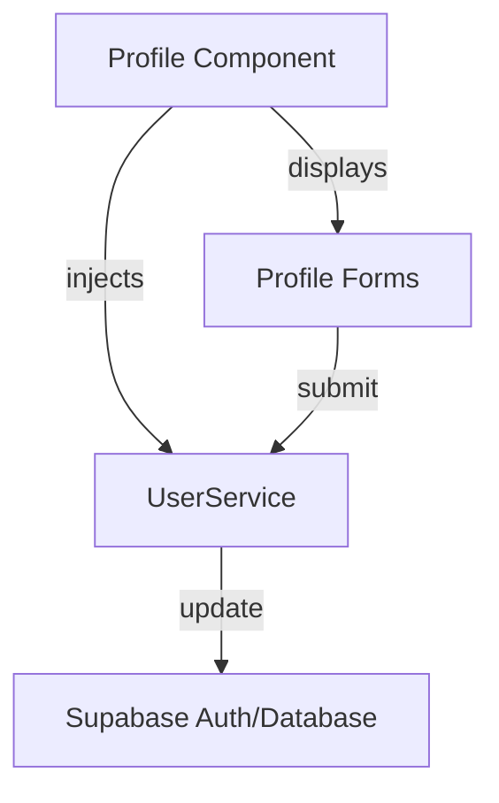
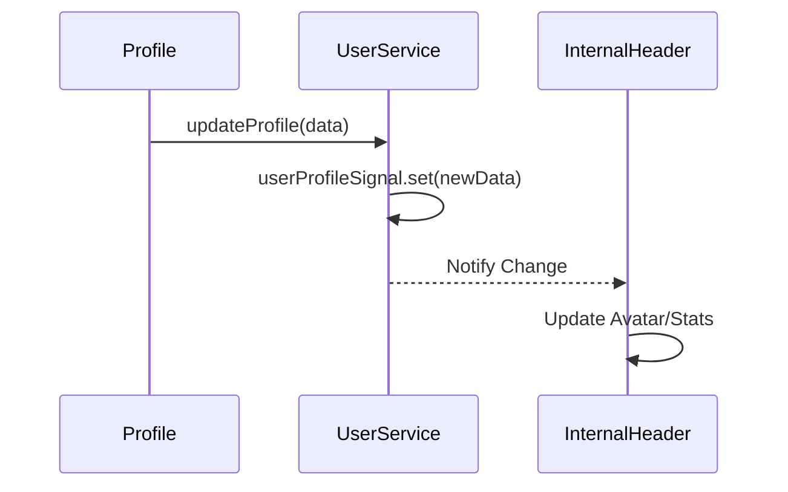
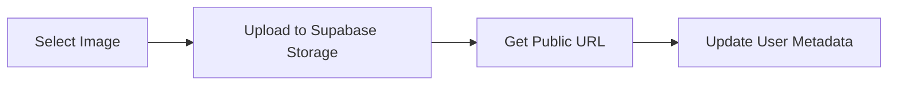
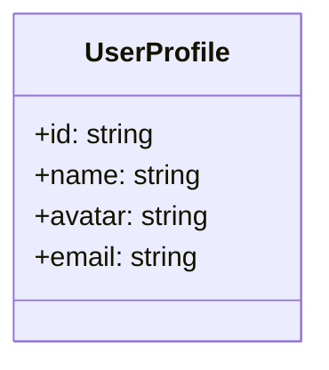

# Design Document

## Overview
The User Profile feature allows authenticated users to manage their personal information (name, avatar, and password). The implementation will follow the **Neon Terminal** design system, utilizing glassmorphism and high-contrast visuals. The core logic will be handled by a new standalone component, while state synchronization will be managed via Angular signals in `UserService` to ensure immediate UI updates across the application.

### Change Type
`new-feature`

### Design Goals
1. Provide a visually stunning and responsive profile interface.
2. Enable secure updates for display name and account password.
3. Support profile avatar upload with immediate reflection in the global header.
4. Ensure all routes are protected and only accessible to authenticated users.

### References
- **REQ-1**: Profile Page Navigation
- **REQ-2**: Name Update
- **REQ-3**: Avatar Management
- **REQ-4**: Password Security
- **REQ-5**: Profile Data Synchronization

## System Architecture

### DES-1: Profile Component
A standalone page component that provides the UI for profile management. It will use Reactive Forms for input handling and validation.



_Implements: REQ-1.1, REQ-1.3, REQ-2.1, REQ-4.1_

### DES-2: Profile Signal Management
Enhancement to `UserService` to expose user profile data as signals. This allows components like `InternalHeader` to reactively update when the user's avatar or name changes.



_Implements: REQ-3.2, REQ-5.1, REQ-5.2_

### DES-3: Avatar Storage Integration
Logic to handle image selection, uploading to Supabase Storage, and updating the avatar URL in the user's metadata.



_Implements: REQ-3.1, REQ-3.3_

### DES-4: Access Control and Routing
Configuring the protected route for profile and adding the navigation link in the `InternalHeader`.

```mermaid
flowchart TD
    Route[/app/perfil] --> Guard[authGuard]
    Guard -->|Allow| PC[Profile Component]
    Guard -->|Deny| Login[Login Page]
```

_Implements: REQ-1.1, REQ-1.2_

## Code Anatomy

| File Path | Purpose | Implements |
|-----------|---------|------------|
| `src/app/pages/app/profile/profile.ts` | Main profile page logic | DES-1 |
| `src/app/pages/app/profile/profile.html` | Profile page template with Neon design | DES-1 |
| `src/app/services/user.ts` | Signal-based profile management and update methods | DES-2, DES-3 |
| `src/app/app.routes.ts` | Route definition for `/app/perfil` | DES-4 |
| `src/app/components/internal-header/internal-header.ts` | Global header subscribing to user signals | DES-2, DES-4 |

## Data Models



## Error Handling

| Error Condition | Response | Recovery |
|-----------------|----------|----------|
| Invalid Name | Display validation error | Block submission |
| Password Mismatch | Display "Senhas não coincidem" | Clear password fields |
| Upload Failure | Display "Falha no upload da imagem" | Allow retry |
| Unauthorized Access | Redirect to Login | Prompt user to log in |

## Impact Analysis

| Affected Area | Impact Level | Notes |
|---------------|--------------|-------|
| `UserService` | Medium | Adding signals and avatar upload logic |
| `InternalHeader` | Low | Adding link and subscribing to user signals |
| `AppRoutes` | Low | Adding new protected route |

### Testing Requirements

| Test Type | Coverage Goal | Notes |
|-----------|---------------|-------|
| Unit | Component logic | Test form validation and service calls |
| Integration | User profile sync | Verify header updates after profile change |

## Traceability Matrix

| Design Element | Requirements |
|----------------|--------------|
| DES-1 | REQ-1.1, REQ-1.3, REQ-2.1, REQ-2.2, REQ-2.3, REQ-4.1, REQ-4.2, REQ-4.3 |
| DES-2 | REQ-3.2, REQ-5.1, REQ-5.2 |
| DES-3 | REQ-3.1, REQ-3.3 |
| DES-4 | REQ-1.1, REQ-1.2 |
