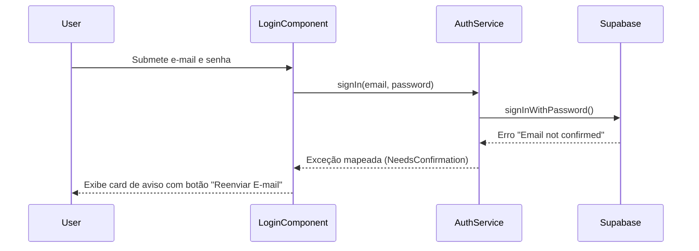
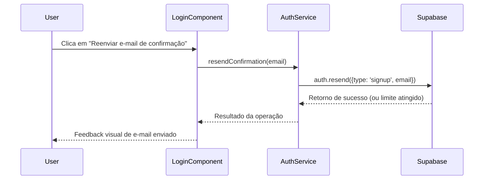
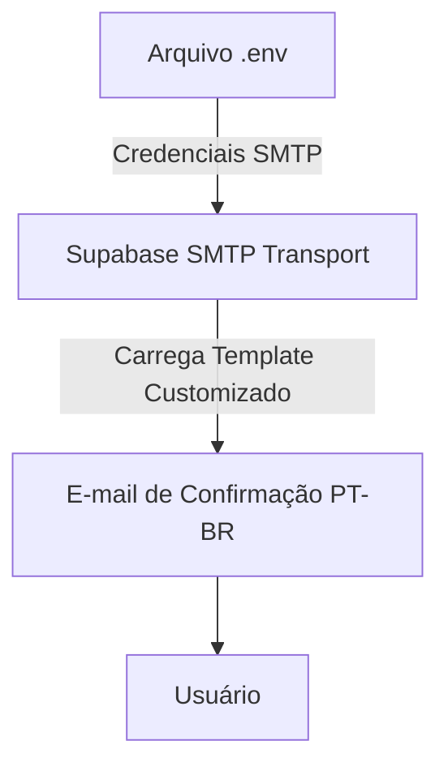

# Design Document

## Overview

A implementação da verificação de e-mail utilizará a funcionalidade nativa do Supabase Auth. O fluxo de registro continuará usando a chamada padrão de registro, mas com a exigência de e-mail confirmado ativa no projeto Supabase. No frontend, o foco será atualizar o componente de login para identificar de maneira específica o erro de "e-mail não confirmado" retornado pela API e fornecer uma interface que permita ao usuário solicitar o reenvio deste e-mail de confirmação. A configuração de SMTP e templates amigáveis deve ser garantida no ambiente de desenvolvimento/produção via `.env` ou `config.toml` do Supabase.

### Change Type

enhancement

### Design Goals

1. Integrar a exigência de confirmação de e-mail no login com feedbacks claros e sem ruptura de layout.
2. Permitir o reenvio automático via frontend utilizando o SDK do Supabase.
3. Manter a coerência com as práticas atuais do Angular 20+ e sinais (signals) para gestão do estado da UI.

### References

- **REQ-1**: Envio de E-mail de Confirmação no Registro
- **REQ-2**: Restrição de Login por E-mail Não Verificado
- **REQ-3**: Reenvio do E-mail de Confirmação
- **REQ-4**: Arquivo de Configuração de E-mail

## System Architecture

### DES-1: Tratamento de Login e Bloqueio

O `LoginComponent` e o `AuthService` trabalharão juntos para autenticar e mapear a resposta de falha. Se o erro for especificamente pela ausência de verificação de e-mail (usualmente através do status HTTP ou mensagem do Supabase), o estado será sinalizado para exibir o bloqueio e a ação de reenvio.

_Implements: REQ-2.1, REQ-2.2_

### DES-2: Fluxo de Reenvio de Confirmação

O componente de login contará com um fluxo secundário ativado pelo botão de reenvio. Esse fluxo chama a API do Supabase encarregada de reenviar os e-mails do tipo `signup`.

_Implements: REQ-3.1, REQ-3.2, REQ-3.3_

### DES-3: Infraestrutura de Envio de E-mails

A aplicação provê um arquivo `.env` contemplando as variáveis SMTP para que o Supabase utilize no momento do disparo. O template de e-mail será estilizado para seguir a identidade visual da plataforma ("Neon Terminal").

_Implements: REQ-1.1, REQ-1.2, REQ-1.3, REQ-4.1_

## Code Anatomy

| File Path | Purpose | Implements |
|-----------|---------|------------|
| `src/app/pages/login/login.ts` | Adicionar signal de `isEmailUnverified` e método `resendEmail()`. Mapear erros. | DES-1, DES-2 |
| `src/app/pages/login/login.html` | Adicionar área com o template de reenvio de e-mail (@if(isEmailUnverified())). | DES-1, DES-2 |
| `src/app/services/auth.service.ts` | Criar método `resendConfirmationEmail(email: string)`. | DES-2 |
| `.env` / `.env.example` | Inserir as propriedades SMTP padrão para documentação e uso. | DES-3 |

## Error Handling

| Error Condition | Response | Recovery |
|-----------------|----------|----------|
| Login bloqueado (Email not confirmed) | Alterar estado de erro do componente para exibir UI de verificação pendente | O usuário clica para reenviar o e-mail |
| Rate Limit no reenvio | Exibir mensagem de alerta (Ex: "Aguarde um momento para tentar novamente") | Tentar reenviar mais tarde |
| Falha no envio do e-mail | Exibir toast/alerta genérico de falha de conexão | Retentar a ação |

## Traceability Matrix

| Design Element | Requirements |
|----------------|--------------|
| DES-1 | REQ-2.1, REQ-2.2 |
| DES-2 | REQ-3.1, REQ-3.2, REQ-3.3 |
| DES-3 | REQ-1.1, REQ-1.2, REQ-1.3, REQ-4.1 |
