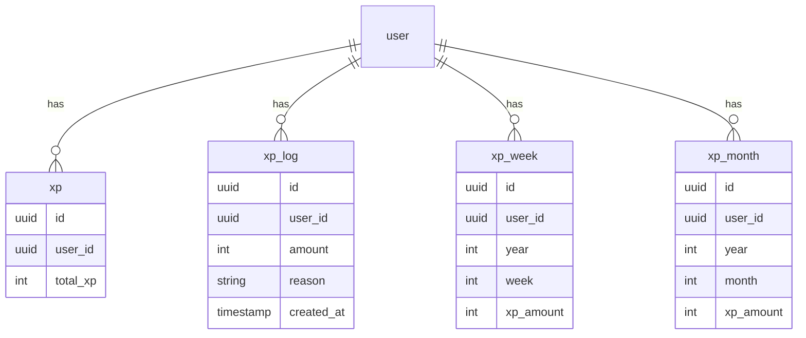
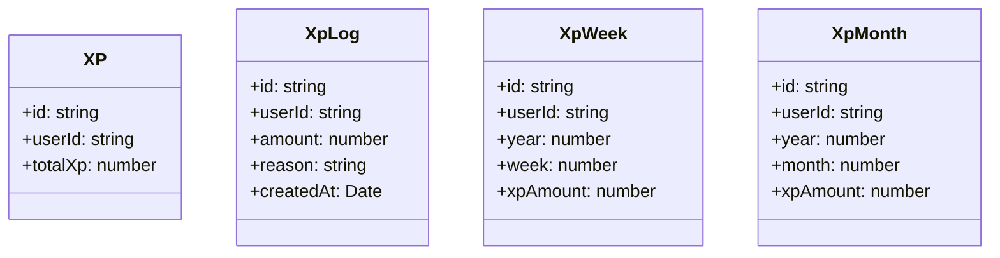

# Design Document

## Overview
This design covers the structure and implementation strategy for the XP gamification tables in Supabase, along with their TypeScript data models. 

### Change Type
new-feature

### Design Goals
1. Establish scalable gamification tables in the database.
2. Build domain-specific models for frontend integration.

### References
- **REQ-1**: Gamification Database Schema
- **REQ-2**: Database Migrations
- **REQ-3**: Domain Data Models

## System Architecture

### DES-1: Gamification Database Schema
The database schema will encompass tables for total XP, historical transactions, and periodic aggregations (weekly and monthly) for leaderboard purposes. A migration will be generated and applied directly.

_Implements: REQ-1.1, REQ-1.2, REQ-1.3, REQ-1.4, REQ-1.5, REQ-2.1, REQ-2.2_

### DES-2: Domain Data Models
TypeScript representations will be added for frontend consistency. They will map the respective Supabase tables using standard project conventions (string for UUID, Date objects for timestamps).

_Implements: REQ-3.1, REQ-3.2, REQ-3.3, REQ-3.4_

## Code Anatomy

| File Path | Purpose | Implements |
|-----------|---------|------------|
| supabase/migrations/xxx_create_xp_tables.sql | Migrations to create gamification tables | DES-1 |
| src/models/xp/xp.ts | Domain model for XP | DES-2 |
| src/models/xp-log/xp-log.ts | Domain model for XP Log | DES-2 |
| src/models/xp-week/xp-week.ts | Domain model for XP Week | DES-2 |
| src/models/xp-month/xp-month.ts | Domain model for XP Month | DES-2 |

## Data Models

## Traceability Matrix

| Design Element | Requirements |
|----------------|--------------|
| DES-1 | REQ-1.1, REQ-1.2, REQ-1.3, REQ-1.4, REQ-1.5, REQ-2.1, REQ-2.2 |
| DES-2 | REQ-3.1, REQ-3.2, REQ-3.3, REQ-3.4 |
